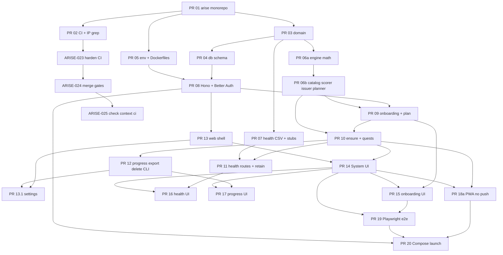
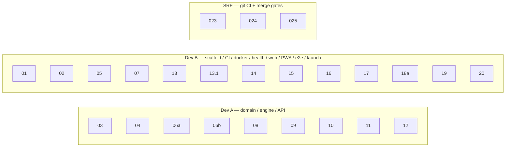

# Arise v1 — Sprint Board

Contract: [`docs/design.md`](../design.md) revision 4. Stories: [`USER_STORIES.md`](./USER_STORIES.md). Team DoD: [`DEFINITION_OF_DONE.md`](./DEFINITION_OF_DONE.md).

Standing v1 team is **2 senior full-stack engineers** (Dev A + Dev B) plus a **part-time Scrum Master**. Sprint 4 also staffs **SRE** for git CI + merge gates only. Product Owner is async after the addendum, except Sprint 5 (polish copy) and Sprint 6 (launch sign-off). Sprints are about **one week**. Package name **`arise`**. Chrome **SYSTEM**.

| Sprint | Theme | PRs | Team size | Status |
| --- | --- | --- | --- | --- |
| Sprint 0 / Sprint 1 | Foundation | 01, 02, 03, 05 | **2 seniors** + 0.1 SM | **Done** |
| Sprint 2 | Engine + DB | 04, 06a, 06b, 07 | **2 seniors** (3 optional) + 0.1 SM | **Done** |
| Sprint 3 | API core | 08, 09, 10 | **2 seniors** (do not add a 3rd) + 0.1 SM | **Done** |
| Sprint 4 | Remaining API + web shell + CI gates | 11, 12, 13, 13.1, SRE 023/024/025 | **2 seniors** + 0.1 SM + SRE | **In progress** |
| Sprint 5 | System UI + remaining web | 14, 15, 16, 17, 18a | **2 seniors** (3 optional after PR 14) + 0.1 SM + PO | Planned |
| Sprint 6 | E2E + Compose launch | 19, 20 | **2 seniors** + 0.1 SM + PO sign-off | Planned |

Sprint 1, 2, and 3 are **Done** on `origin/main`. Sprint 4 is **In progress**. Sprints 5–6 stay Planned.

PR **18b** is **not** on this board. See [Later](#later-not-on-the-v1-board).

---

## Merge graph (from the design)



Text form from the design (identical DAG):

```text
01 → 02
01 → 03 → 04
01 → 05
03 → 06a → 06b
03 → 07
04 + 05 → 08 → 09 → 10 → 11 → 12
08 → 13 → 13.1
10 + 13 → 14 → 15
11 + 14 → 16
12 + 14 → 17
10 + 14 → 18a
15 + 14 → 19
18a + 19 + 08 → 20
02 → 023 → 024 → 025
```

---

## Capacity and staffing

Fibonacci points. **8 only for PR 06b, 08, 10, 14.** Two seniors ≈ 16–24 pts/week.

| Sprint | Points | Dev A | Dev B | Team size | Load |
| --- | --- | --- | --- | --- | --- |
| 1 | 10 | 3 | 7 | 2 | Light — foundation |
| 2 | 23 | 18 | 5 | 2 (3 optional) | Heavy — 06b is an 8 |
| 3 | 21 | 21 | 0 | 2 | Heavy — A owns all three API PRs; B reviews + spike assist |
| 4 | 24 | 10 | 8 | 2 + SRE | Balanced — A 10, B 8, SRE 6 |
| 5 | 24 | 0 | 24 | 2 (3 optional after 14) | Heavy — B owns chrome; A reviews engine/API contracts |
| 6 | 10 | 0 | 10 | 2 | Launch + e2e; A on-call for API defects |

**v1 product: 22 stories, 106 points, 6 sprints.** **Plus SRE ops: 3 stories, 6 points (Sprint 4).** **Board total: 25 stories, 112 points.** Default staff: 2 seniors. Sprint 4 adds SRE. Do not staff 4+ product implementers in any sprint — the DAG cannot keep them busy.

### Standing roles (all sprints)

| Role | Count | When they work |
| --- | --- | --- |
| Senior full-stack (Dev A) | 1 | Domain, engine, API. Reviews B’s PRs until PASS. |
| Senior full-stack (Dev B) | 1 | Scaffold, CI, Docker, health adapters, web, PWA, e2e, launch. Reviews A’s PRs until PASS. |
| Scrum Master | 0.1 FTE | Board, DoD, peer-review gate. Not an implementer. |
| Product Owner | 0–0.25 FTE | Addendum already shipped. Needed in Sprint 5 (polish P1–P10) and Sprint 6 (launch accept). |
| Site Reliability (SRE) | 1 (Sprint 4) | Harden GitHub Actions + merge gates + check-context docs. **Not** Cloudflare `deploy.yml` / Workers / Caddy. |

No dedicated designer, native, ML, or QA hire for v1. Playwright + Vitest goldens are in the stories. SRE is Sprint 4 only, git + merges — not a hosting hire.

---

## Sprint 0 / Sprint 1 — Foundation

**Status: Done** (01, 02, 03, 05 on `main` with peer PASS)  
**Goal:** `arise` monorepo, CI IP grep, domain types, and Compose file skeletons (no fake `/health` app).  
**PRs:** 01, 02, 03, 05  
**Points:** 10

**Team size: 2 seniors** + part-time Scrum Master. A third engineer is idle after 01 lands.

| Requirement | Need |
| --- | --- |
| Skills | TypeScript 5 strict monorepo, pnpm 9 + Turborepo, GitHub Actions, Docker Compose, Node 22 |
| Tools on the machine | Node 22, pnpm 9.15.0, Git, Docker engine when touching Compose files |
| Roles this sprint | Dev A (PR 03), Dev B (01/02/05 — 01 already done by A), SM (board only) |
| Not required | React UI, Hono, Drizzle, Playwright, Better Auth, PO on daily standups |

| ID | Title | PR | Assignee | Pts | Deps | Status |
| --- | --- | --- | --- | --- | --- | --- |
| ARISE-001 | Scaffold the arise monorepo | 01 | Dev A (implemented; originally B) | 3 | — | **Done** — peer PASS |
| ARISE-002 | CI lint, typecheck, test, and forbidden-string grep | 02 | Dev B | 2 | ARISE-001 | **Done** — peer PASS |
| ARISE-003 | Domain Zod types for player, goal, quest, health, plan, effects | 03 | Dev A | 3 | ARISE-001 | **Done** — peer PASS |
| ARISE-005 | .env.example and Dockerfiles (no fake /health app) | 05 | Dev B | 2 | ARISE-001 | **Done** — peer PASS |

**Parallelism:** After ARISE-001 merges, A does domain (03) while B does CI (02) and Docker/env (05).

**Sprint 1 exit:**

- [x] `package.json` `"name": "arise"`. `pnpm -r` works.
- [x] CI greps `FORBIDDEN.txt` (`rg -i -f FORBIDDEN.txt --glob '!grok-design*' --glob '!.git/**'`) and fails the build on hits.
- [x] Domain types use **`intl` not `int`**. Ranks **E–S**. `RegisterBody` / `OnboardingBody` exist.
- [x] `docker-compose.yml` is one service; **no** Caddy; Compose `up` may fail until PR 08 — documented.
- [x] No Solo Leveling IP strings. No v1.1 files (`push/`, Apple XML, `deploy.yml` as a deliverable).

---

## Sprint 2 — Engine + DB

**Status: Done** on `origin/main`  
**Goal:** Schema + `atomic()`, closed-form XP/rank/safety, 16-template issuer, health adapters.  
**PRs:** 04, 06a, 06b, 07  
**Points:** 23  
**Assignment:** [`docs/dev/SPRINT2_ASSIGNMENT.md`](../dev/SPRINT2_ASSIGNMENT.md)

**Team size: 2 seniors required.** A third senior is **optional** only if the calendar cannot absorb A’s 18 points (split PR 04 off A onto the third; do not split 06b). **This kickoff does not staff a third** — 2 seniors + 0.1 SM. PO not required.

| Requirement | Need |
| --- | --- |
| Skills | Drizzle + SQLite, dual-runtime `atomic()` (better-sqlite3 vs D1 `batch`), closed-form XP/rank/recovery/safety, Vitest goldens, CSV parse + Zod |
| Tools | Node 22, pnpm, Vitest, SQLite CLI |
| Roles this sprint | Dev A (04, 06a, 06b), Dev B (07 + review A), SM |
| Not required | React, PWA, Hono routes, Better Auth, Docker production image, PO |

| ID | Title | PR | Assignee | Pts | Deps | Status |
| --- | --- | --- | --- | --- | --- | --- |
| ARISE-004 | Drizzle schema, migrate, and atomic() wrapper | 04 | Dev A | 5 | ARISE-003 | **Done** — peer PASS, on `origin/main` |
| ARISE-006 | Engine XP, rank, recovery, safety, and effect helpers | 06a | Dev A | 5 | ARISE-003 | **Done** — peer PASS, on `main` |
| ARISE-007 | 16-template catalog, scorer, issuer, and planner | 06b | Dev A | 8 | ARISE-006 | **Done** — peer PASS, on `main` |
| ARISE-008 | Normalize health samples, manual + small CSV, and unavailable stubs | 07 | Dev B | 5 | ARISE-003 | **Done** — peer PASS, on `main` |

**Parallelism (first slice, start now):** A starts **006** (`feat/ARISE-006-engine-math`, critical path to 06b). B starts **008** (`feat/ARISE-008-health-csv`). **004** after 006 is on `main` (or immediately after 006 is pushed if A has bandwidth — **do not mix 004 and 006 on one branch**). **007** only after 006 peer PASS.

**Sprint 2 exit:**

- [x] Mocked `batch` throw ⇒ `SELECT COUNT(*) FROM issuance_ledger` is **0**.
- [x] Goldens: `xpToNextLevel(1) === 100`, `(10) === 2239`, `(25) === 7713`, `(50) === 19661`.
- [x] Scorer: **`score === 80`** for `str_goblet_squat_l1` vs `muscle_gain` (empty history, remaining 40, recovery 80). `goalAlignment === 55`.
- [x] Exactly **16** template ids. No `habit_log_weight`. Empty-day fallback is `habit_sleep_window` + `cardio_zone2_walk` @ 10 min.
- [x] CSV ≤ **256 KB** / **200** rows. Stubs throw `unavailable_web` / `UNAVAILABLE_WEB`.
- [x] No `users` table. XP on `profiles` only. No `push_subscriptions`.

---

## Sprint 3 — API core

**Status: Done**  
**Goal:** Node Hono + Better Auth (invite fail-closed, age 16+), onboarding/plan gates, ensure/complete/skip.  
**PRs:** 08, 09, 10  
**Points:** 21  
**Assignment:** [`docs/dev/SPRINT3_ASSIGNMENT.md`](../dev/SPRINT3_ASSIGNMENT.md)

**Team size: 2 seniors. Do not add a third** — 08 → 09 → 10 is serial on one API owner. Extra people wait.

| Requirement | Need |
| --- | --- |
| Skills | Hono 4 on Node 22, Better Auth + username plugin + scrypt, cookie sessions, Zod façades, query-budget SQL, safety gates (age, invite, pregnancy, loss rate) |
| Tools | Node 22, pnpm, optional Cloudflare account **only** for the required Free Worker spike note (not production) |
| Roles this sprint | Dev A (08, 09, 10), Dev B (review + Free Worker spike assist + Vite proxy prep), SM |
| Not required | SYSTEM UI, PWA, Playwright, third implementer, PO |

| ID | Title | PR | Assignee | Pts | Deps | Status |
| --- | --- | --- | --- | --- | --- | --- |
| ARISE-009 | Hono Node API, Better Auth username + scrypt, and Workers Free spike | 08 | Dev A | 8 | ARISE-004, ARISE-005 | **Done** — peer PASS, on `main` |
| ARISE-010 | Onboarding, plan preview/regenerate, pregnancy and loss-rate gates | 09 | Dev A | 5 | ARISE-007, ARISE-009 | **Done** — peer PASS, on `main` |
| ARISE-011 | Issue today’s quests, complete, skip, and lazy fail | 10 | Dev A | 8 | ARISE-007, ARISE-010 | **Done** — peer PASS, on `main` |

**Parallelism:** 08 → 09 → 10 all landed with peer PASS.

**Sprint 3 exit:**

- [x] Cookie name **`arise.session`**. scrypt default. `minPasswordLength: 10`. Session 30 days, `updateAge` 1 day.
- [x] `age < 16` → **`400 AGE_RESTRICTED`**, **zero rows**.
- [x] Missing/empty `REGISTER_INVITE_CODE` → **`503 INVITE_UNCONFIGURED`** (fail-closed). Mismatch → **`403 INVITE_REQUIRED`**.
- [x] Worker without `ALLOW_WORKER_PASSWORD_AUTH=true` → **`501 AUTH_RUNTIME_UNSUPPORTED`**.
- [x] Spike: Free Worker sign-in CPU abort recorded in `apps/api/README.md`; deploy not left as production.
- [x] `GET /health` **no DB**, 30/min/IP. `GET /ready` is `SELECT 1`.
- [x] `parq.pregnancy === true` → **403 `PREGNANCY_HARD_STOP`**, no goal/habit/plan.
- [x] Implied loss > 1% BW/week → **400 `UNSAFE_LOSS_RATE`** + `details.maxKgPerWeek`.
- [x] `GET /me/today` **0 writes**. `POST /me/today/ensure` rejects non-today (`400 ENSURE_DATE_NOT_TODAY`). Issue+catch-up ≤ **12** statements. Complete ≤ **8**.
- [x] XP on `profiles.xp`. Partial = 50% XP. 3rd `busy` skip in ISO week → `failed`.

---

## Sprint 4 — Remaining API + web shell + CI gates

**Status: In progress**  
**Goal:** Health ingest + retain cron, GDPR export/delete/CLI, Vite login/register, settings, plus SRE CI harden + merge gates.  
**PRs:** 11, 12, 13, 13.1, SRE 023/024/025  
**Points:** 24 (product 18 + SRE 6)  
**Assignment:** [`docs/dev/SPRINT4_ASSIGNMENT.md`](../dev/SPRINT4_ASSIGNMENT.md)

**Team size: 2 seniors + 0.1 SM + SRE.** PO **not required**. 13 and 12 are on `main`; 13.1 (015) is **In progress**.

| Requirement | Need |
| --- | --- |
| Skills | Health ingest + consent, Node cron retain, GDPR export/delete, admin CLI, Vite 6 + React 19, TanStack Router, `credentials: 'include'` same-origin cookies, GitHub Actions cache/concurrency, branch protection via `gh` |
| Tools | Node 22, pnpm, Vite `:5173` → API `:8787`, `gh` (Administration optional) |
| Roles this sprint | Dev A (11, 12), Dev B (13, 13.1), **SRE** (023, 024, 025), SM |
| Not required | Full SYSTEM chrome, service worker, Playwright, Compose launch image, PO, Cloudflare `deploy.yml` / Workers / Caddy |

| ID | Title | PR | Assignee | Pts | Deps | Status |
| --- | --- | --- | --- | --- | --- | --- |
| ARISE-012 | Health ingest, consent, daily summaries, and retain job | 11 | Dev A | 5 | ARISE-008, ARISE-011 | **In review** — peer PASS, PR #3, rebasing onto main after 013 merge |
| ARISE-013 | Progress, JSON export, account delete, and reset-password CLI | 12 | Dev A | 5 | ARISE-011 | **Done** — merged PR #6 |
| ARISE-014 | Vite web shell with proxy, login, and register | 13 | Dev B | 5 | ARISE-009 | **Done** — merged PR #2 |
| ARISE-015 | Settings: units, logout, delete, and export download | 13.1 | Dev B | 3 | ARISE-013, ARISE-014 | **In progress** — Dev B, unblocked (13+12 on main) |
| ARISE-023 | Harden GitHub Actions CI for PRs and main | — | SRE | 3 | ARISE-002 | **Done** — merged PR #1 |
| ARISE-024 | Merge gates for main | — | SRE | 2 | ARISE-023 | **Done** — protection live |
| ARISE-025 | Document required GitHub check context as `ci` | — | SRE | 1 | ARISE-024 | **Done** — merged PR #5 (docs + template + gh api snippet use context `ci`) |

**Parallelism (now):** **013** is **Done** (merged PR #6). **014** is **Done** (merged PR #2). **012** is **In review** (peer PASS, PR #3; Dev A rebasing onto `origin/main` after the 013 merge). **015** is **In progress** (Dev B, unblocked now that 13+12 are on `origin/main`). **023**, **024**, and **025** are **Done** on `origin/main` (PRs #1 / protection / #5). Required check context is **`ci`**.

**Sprint 4 exit:**

- [ ] First health POST requires `{ "consent": true }` else **`403 HEALTH_CONSENT_REQUIRED`**. Samples max **200**.
- [ ] Node cron `15 3 * * *` UTC: retain chunks of 500 + penalty catch-up **25 users/tick**. **No push job.**
- [x] `GET /me/export` attachment **`arise-export.json`**, no `accounts.password`. **013 Done** (PR #6).
- [x] Forget-password **404** if `SMTP_URL` unset. CLI: `pnpm --filter api exec tsx src/cli/reset-password.ts --identifier USER --password -`. **013 Done** (PR #6).
- [x] Vite `:5173` proxies `/api` → `http://127.0.0.1:8787`. `credentials: 'include'`. Relative `/api/v1/...`. **014 Done** (PR #2).
- [ ] Settings: units (store metric), tz, logout, delete, export. Shared-phone IndexedDB warning present.
- [x] CI: concurrency cancel-in-progress; Node 22 + pnpm 9 store cache; frozen-lockfile; forbidden-string grep fail-closed; typecheck+test fail the job (no `--if-present` skip when scripts exist). **023 Done** on `origin/main` (PR #1).
- [x] Branch protection live on `main`: PR required, required check context **`ci`**, reviews required 0, `enforce_admins: true`, no force-push. **024 Done.**
- [x] Docs + PR template + operator `gh api` snippet name the required check context **`ci`** (not `CI / ci`) — **025 Done** (PR #5).
- [ ] **No** `.github/workflows/deploy.yml`. **No** Workers / Caddy work.

### SRE intake

SRE may file extra deps after they start. SM appends them here (next IDs after the current last story). Do not invent product scope.

| ID | Title | Pts | Deps | Status | Notes |
| --- | --- | --- | --- | --- | --- |
| ARISE-025 | Document required GitHub check context as `ci` | 1 | ARISE-024 | **Done** | Merged PR #5. Live protection context is `ci`. Docs + PR template + `gh api` snippet use `contexts: ["ci"]`. Not a new workflow. Not deploy.yml. |

---

## Sprint 5 — System UI + remaining web

**Status: Planned**  
**Goal:** SYSTEM window + onboarding/health/progress UI + PWA install/outbox. **No Web Push.**  
**PRs:** 14, 15, 16, 17, 18a  
**Points:** 24

**Team size: 2 seniors required.** A third senior is **optional after PR 14 merges**, to run 15/16/17/18a in parallel. Before 14, a third sits idle.

| Requirement | Need |
| --- | --- |
| Skills | React 19 SYSTEM UI (`packages/ui`), TanStack Query, six-step onboarding, CSV importer UX, PWA (`vite-plugin-pwa`, SW, IndexedDB outbox). **No** Web Push / VAPID |
| Tools | Node 22, pnpm, browsers for install/outbox checks (desktop + a phone viewport) |
| Roles this sprint | Dev B (14 then 15–18a), Dev A (contract review: 16 templates, `intl`, no `push` in `sw.ts`), **PO 0.25 FTE** for polish P1–P10 copy, SM |
| Not required | Native, designer hire (addendum + design tokens), LLM, social |

| ID | Title | PR | Assignee | Pts | Deps | Status |
| --- | --- | --- | --- | --- | --- | --- |
| ARISE-016 | SYSTEM window: panels, quest cards, rank-up, and disclaimer | 14 | Dev B | 8 | ARISE-011, ARISE-014 | Planned |
| ARISE-017 | Six-step onboarding wizard and plan preview | 15 | Dev B | 5 | ARISE-010, ARISE-016 | Planned |
| ARISE-018 | Manual health entry and CSV importer UI | 16 | Dev B | 3 | ARISE-012, ARISE-016 | Planned |
| ARISE-019 | Progress UI for XP, stats, and rank history | 17 | Dev B | 3 | ARISE-013, ARISE-016 | Planned |
| ARISE-020 | PWA install, service worker, and IndexedDB outbox (no Web Push) | 18a | Dev B | 5 | ARISE-016, ARISE-011 | Planned |

**Parallelism:** 14 is the gate. After 14: 15, 16, 17, 18a can proceed in any order (16 needs 11; 17 needs 12; both already in Sprint 4). Dev A reviews contract adherence (16 template ids, `intl`, no push in `sw.ts`).

**Sprint 5 exit:**

- [ ] Chrome says **SYSTEM**. Dark only. Disclaimer on every System window.
- [ ] GET today; if `needsEnsure` then POST ensure; then render. Complete / partial / skip wired.
- [ ] `suggestRegenerate` is a **button**, not auto-regenerate.
- [ ] Six-step wizard; pregnancy **dead-end** + Delete account; preview is `POST /plan/preview` (0 writes).
- [ ] CSV UI rejects `size > 262144` or `rows > 200` **before** parse.
- [ ] Manifest name **“Arise”**, theme **`#050816`**, `display: standalone`.
- [ ] **No** `push` event in `sw.ts`. No VAPID. PR 18b not merged.
- [ ] Outbox drops item on `409 DAY_CLOSED` and shows “the day closed.”

---

## Sprint 6 — E2E + Compose launch

**Status: Planned**  
**Goal:** Playwright happy path and `docker compose up --build` on a **fresh** volume at `http://localhost:8080`.  
**PRs:** 19, 20  
**Points:** 10

**Team size: 2 seniors** + PO launch sign-off. A third implementer is idle (19 then 20 is serial).

| Requirement | Need |
| --- | --- |
| Skills | Playwright e2e, multi-stage Docker (`pnpm --filter api deploy --prod`), SPA fallback, sqlite `.backup` cron |
| Tools | Node 22, pnpm, Playwright browsers, **Docker engine running** (Rancher Desktop / Compose), SQLite CLI |
| Roles this sprint | Dev B (19, 20), Dev A (on-call for ensure/auth defects), SM, **PO** accepts PR 20 against the design’s launch checklist |
| Not required | Cloudflare, Caddy, custom domain, wrangler, extra QA hire |

| ID | Title | PR | Assignee | Pts | Deps | Status |
| --- | --- | --- | --- | --- | --- | --- |
| ARISE-021 | Playwright happy path: register, onboard, ensure, complete | 19 | Dev B | 5 | ARISE-017, ARISE-016 | Planned |
| ARISE-022 | docker compose up --build is the v1 launch path | 20 | Dev B | 5 | ARISE-021, ARISE-020, ARISE-009 | Planned |

**Parallelism:** 19 before 20. Dev A stands by for ensure/auth defects found in e2e or Compose.

**Sprint 6 / v1 launch exit (PR 20 acceptance — only this):**

- [ ] `docker compose up --build` on a **fresh** named volume.
- [ ] Register from `http://localhost:8080/register` with the invite code (age ≥ 16).
- [ ] Deep-link refresh of `/onboarding` returns the SPA (**not** 404).
- [ ] Image contains `/app/web/index.html` and a working `node dist/node.js` (`pnpm deploy`, not workspace `node_modules`).
- [ ] Playwright: register (**age 20**) → onboard → ensure → complete one → XP up.
- [ ] Backup cron `45 3 * * *` spawns `backup-sqlite.sh` (14-day retain). D1 Time Travel is **not** a backup.
- [ ] **Not in PR 20:** `wrangler.toml`, `deploy.yml`, `Caddyfile`, custom domains, Workers Paid. Those must not block merge.

---

## Swimlane (who owns which box)



---

## WIP, git, and review rules

Git procedure (mandatory): [`docs/dev/GIT_WORKFLOW.md`](../dev/GIT_WORKFLOW.md).

- **Pull → feature branch → work → commit → push to GitHub.** Every story. No implementing on `main`. No “Done” that exists only in a worktree.
- One in-flight PR per assignee unless a PR is blocked on review.
- Engine tests before chrome (design PR plan). **PR 14 cannot merge before PR 06b and PR 10.**
- Peer review must **PASS** before merge (see [`DEFINITION_OF_DONE.md`](./DEFINITION_OF_DONE.md)). After PASS, merge is pushed to `origin/main`.
- Invite-only and age 16+ are load-bearing from the first auth PR (08), not “later hardening.”
- Compose is the only v1 topology. Do not accept cloud/Caddy/domain work in any sprint.

---

## Later (not on the v1 board)

| Item | Where it lives | Why it is out |
| --- | --- | --- |
| **PR 18b** Web Push / VAPID | v1.1 | Listed so it is not sneaked into 18a |
| Apple XML / `export.zip` | v1.1 | No large-file parse in v1 |
| Habit-learning auto-regenerate | v1.1 | v1 only sets `suggestRegenerate: true` |
| Catalog > 16 templates | v1.1 | Appendix A is the full set |
| Workers Paid + Static Assets | §16.3 later option | Not a v1 deliverable; must not block PR 20 |
| `deploy.yml` / `wrangler.toml` / Caddy TLS / custom domain | later | Owner 2026-08-14: Compose on localhost only |
| Capacitor, HealthKit/Connect live, LLM planner, social | v2 / non-goal | Store fees / nondeterminism / out of cut |

Do not create Sprint 7 for these. Do not put 18b on Sprint 5 or 6.
