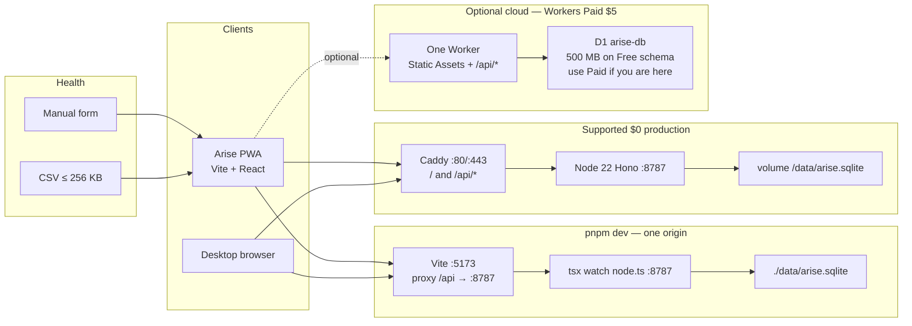
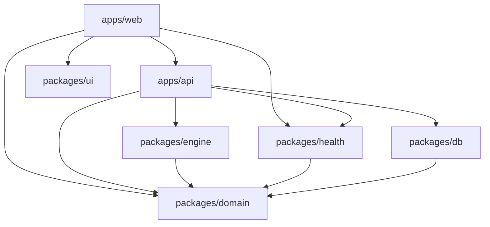
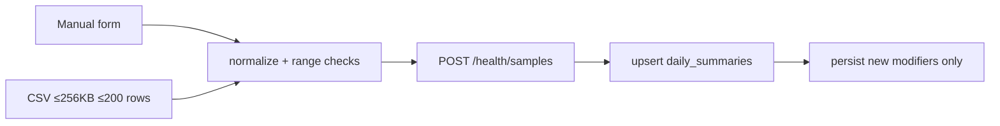

# Arise — System Architecture & Product Design

| Field | Value |
| --- | --- |
| **Document title** | Arise — Fitness Training Platform Design |
| **Author** | Systems architecture (owner-accepted, 2026-08-14) |
| **Date** | 2026-08-14 |
| **Status** | **Accepted** (revision 4 — owner decisions locked) |
| **Audience** | Senior engineers implementing the product incrementally from the PR plan |
| **Workspace surveyed** | `C:\Users\Timus97\Desktop\grokAnalysis\SololevelingApp` — **empty greenfield**. No `package.json`, no README, no source. Every path below is a **create** instruction. |
| **Repository / npm name** | **`arise`**. Do not publish or push a GitHub repo named `SololevelingApp`. Rename the working folder before the first remote. |

---

## Overview

Arise is a web + installable Progressive Web App that wraps evidence-informed fitness programming in an original holographic “System” interface: daily quests, stat growth, ranks, streaks, and safe penalties. The user states a goal, describes their real schedule and equipment, and the **quest engine** generates a weekly plan and issues daily quest instances. Manual entry and a small CSV template feed a normalized health pipeline that can auto-complete or shrink step/sleep quests.

**Hosting honesty (load-bearing):** **v1 launch is Docker Compose on localhost / the operator’s machine** — one Node 22 container (Hono + SQLite + static PWA). That is the only v1 topology. Password hashing, cron, backups, and same-origin cookies all run in that process. There is **no custom domain** and **no Caddy TLS work** in v1. **Workers Paid, Workers Free, and any public/cloud URL are out of v1 scope.** A Paid + Static Assets recipe stays in §16.3 as a **later option** the owner may use after launch; it is not a v1 deliverable.

v1 is a TypeScript monorepo: Vite + React PWA, Hono API on Node, SQLite via Drizzle, Better Auth (scrypt on Node), rule-based planner, **16** in-code quest templates. Invite-only (`REGISTER_INVITE_CODE` required). Age 16+ at register. No App Store, no LLM, no Web Push, no Apple XML, no Web Bluetooth ingest.

---

## Background & Motivation

### Why this product

Generic trackers log what already happened. Arise is meant to **tell the user what to do today**, in a fantasy register they will actually open, then **rewrite today** when sleep, steps, or fatigue say the original prescription is wrong.

### Current state

Greenfield. The on-disk folder may still be named `SololevelingApp`; that name is a trademark risk and is **not** the package name. PR 01 initializes npm/git as `arise`.

### Pain points the design absorbs

| Pain | Design response |
| --- | --- |
| Store fees | PWA only in v1 |
| HealthKit / Health Connect are native-gated | Adapter stubs + honest copy; v1 ingest is manual + small CSV |
| Paid BaaS / AI | Hono + SQLite + templates |
| Punishment-workout liability | Easy penalty quests, PAR-Q, pregnancy hard-stop, persistable effect windows |
| Official IP + folder name | Original SYSTEM chrome; repo/package `arise`; CI forbidden-string grep |
| Free-tier fantasy | Compose is the $0 product; CF Free is not a working auth host |

---

## Goals & Non-Goals

### Goals (v1) — ruthless cut

- Onboarding (disclaimer, PAR-Q, age, goal, schedule, equipment) → 7-day plan.
- System window: today’s quests, stats, rank, streak; complete / partial / skip; server-side fail at local midnight (via `POST /me/today/ensure`).
- XP, ranks E→S, five stats, safe penalty quest, persistable safety windows.
- Manual health + **small** CSV (≤ 256 KB, ≤ 200 rows). Step/sleep auto-complete from those.
- PWA install (manifest + service worker + offline **read** of last today payload + outbox for completions). **No Web Push.**
- `docker compose up --build` on localhost (port 8080) is the **only** v1 production path. Local `pnpm dev` with a Vite `/api` proxy for engineers.
- First deploy is **invite-only** (`REGISTER_INVITE_CODE` required, fail-closed).
- Safety: medical disclaimer, pregnancy hard-stop, age **16+** at register (no row if under 16), contraindication filters, rest-day enforcement, implied fat-loss rate check.

### Non-goals (v1)

- Native stores, HealthKit, Health Connect.
- Apple Health `export.zip` / XML parse (v1.1).
- Web Bluetooth (not even as “live HR theater”).
- Web Push / VAPID / iOS push education (v1.1, Docker-only or Workers Paid).
- LLM planner, social, diet macros, i18n, light theme, ads, subscriptions.
- Habit-learning auto-regenerate (v1.1). v1 uses the onboarding week as-is.
- Catalog beyond the **16** templates in Appendix A.
- Cloudflare Free as a supported API host.
- Pages + separate Worker on `*.pages.dev` / `*.workers.dev`.
- **Workers Paid / public cloud URL / custom domain / Caddy TLS** — later option only; not v1 launch.

### Key product defaults

| Decision | Default |
| --- | --- |
| Language | English |
| Units | Metric + imperial toggle; store metric |
| Social / PvP | Off (no flag) |
| Monetization | None |
| Theme | Dark System only |
| Planner | Rule-based, 16 templates |
| Identity | **Email required** + password; optional username as a login alias; SMTP optional; recovery = admin CLI if no SMTP |
| $0 host / v1 launch | Docker Compose on localhost / operator machine (`http://localhost:8080`) |
| Invite | `REGISTER_INVITE_CODE` **required** (fail-closed if unset) |
| Age | 16+; reject at register with zero rows |
| Cloud / domain | **Out of v1.** Later option: Workers Paid + Static Assets. No custom domain in v1. |

---

## Key Decisions

1. **Product name is Arise; in-app chrome says SYSTEM.** Locked by owner 2026-08-14. No *Solo Leveling* marks, character names, or screenshots. Git/npm name is `arise`, not `SololevelingApp`.

2. **PWA-first, one TypeScript codebase.** Capacitor is v2 and requires store fees.

3. **Vite + React SPA, not Next.js.** Authenticated client; SSR unused; `vite-plugin-pwa` + Vite `/api` proxy.

4. **Hono with dual *source* adapters; Node is the supported runtime.** `src/node.ts` is v1 production. `src/worker.ts` exists so the same routes can be deployed to **Workers Paid** later. Worker Free is not a target.

5. **SQLite everywhere (Drizzle).** File on Node; D1 only if/when Workers Paid is chosen. Same migrations.

6. **Better Auth, default scrypt, Node-only for password verify.** Username plugin on. Session 30 days, `updateAge` 1 day, cookie name `arise.session`. **Rejected combination:** Better Auth default scrypt on Workers Free (10 ms). See KD 16.

7. **v1 launch is Compose on localhost / the operator’s machine.** Cloudflare Free is not an API host. Workers Paid + custom domains are a **later option** (owner 2026-08-14), not a v1 deliverable. No pretending `*.pages.dev` is a full stack.

8. **Quest engine is `packages/engine` with no I/O.** Closed-form scorers in §9.3. Golden tests required.

9. **Issuance is explicit `POST /me/today/ensure`, not a mutating GET.** Idempotency key `(user_id, local_date)` via `batch()` / a Node transaction wrapper.

10. **Rule-based planner in v1.** `FEATURE_LLM_PLANNER` does not exist until v2.

11. **Health is provider-agnostic internally; v1 adapters are manual + small CSV only.** Native and Apple-XML adapters are typed stubs that throw `unavailable_web`.

12. **No large-file parse on client or server in v1.** CSV ≤ 256 KB. Apple zip deferred.

13. **Safety over lore.** Penalties are easy walks. Effect windows persist. Pregnancy is a hard stop. Implied loss > 1% BW/week is rejected.

14. **No transactional email required.** Optional SMTP. Else `pnpm arise admin reset-password`.

15. **Monolith API process.** Cron is daily retention (+ Node-only penalty backstop). No queue.

16. **Password hashing vs 10 ms:** scrypt (Better Auth default) on Node and on Workers Paid only. Workers Free auth routes must not be deployed. PR 08 includes a **required spike**: deploy sign-up/sign-in to a Free Worker, record the CPU abort, and keep a note in `apps/api/README.md`. A weaker custom `password.hash` (PBKDF2-SHA-256, iteration count measured &lt; 8 ms) is **not** the default and is not scheduled. Do not “roll our own” to paper over Free.

17. **One origin everywhere in v1.** Dev: Vite proxies `/api` → `127.0.0.1:8787`. Launch: **one Node container** serves `/api/*` and the PWA (`SERVE_STATIC=true`, SPA fallback to `index.html`) at `http://localhost:8080`. **No Caddy TLS / custom domain in v1** (owner 2026-08-14). Workers Static Assets is a later option only. Pages + Worker dual subdomain is rejected.

18. **In-code catalog, 16 templates.** No `quest_templates` CMS. Table may exist empty for v1.1; v1 reads `packages/engine/src/templates/catalog.ts` only.

19. **Email is required; username is an optional alias.** Better Auth `user.email` stays required/unique (library default). The username plugin is enabled so sign-in may use email **or** username; register Zod requires `email`. No username-only accounts (they break Better Auth’s email column). Forgot-password: SMTP if `SMTP_URL` set, else operator CLI.

20. **v1 launch target is `docker compose up --build` on localhost / the operator’s machine.** No public cloud, no custom domain, no Caddy TLS in v1 (owner 2026-08-14). Workers Paid remains documented in §16.3 as a later option only.

21. **Auth rate limit is process memory on Node; D1 `secondaryStorage` on Workers Paid.** Compose is one process — Better Auth’s default memory store is correct. Worker isolates are not sticky, so `RUNTIME=worker` **must** pass Better Auth `secondaryStorage` backed by D1 table `auth_rl` (rate-limit keys only). Do not claim in-memory `rateLimit.max = 10` works on the edge. Health ingest still uses `rate_limits`. `/health` stays isolate-local, 30/min/IP, no DB.

22. **Partial completion is client-declared.** `effort: "full" | "partial"`. No set-by-set log in v1. Partial = 50% XP if the user attests they did at least half the work.

---

## Proposed Design

### 1. System context



**v1 default runtime:** Compose or `pnpm dev`. Worker entrypoint is compiled but **not** the launch host.

### 2. Logical components



### 3. Recommended stack

| Layer | Choice | License | Notes |
| --- | --- | --- | --- |
| Repo | pnpm 9 + Turborepo | MIT | package name `arise` |
| Language | TypeScript 5.x strict | Apache-2.0 | |
| Web / PWA | Vite 6 + React 19 + TanStack Router + Query + `vite-plugin-pwa` | MIT | `/api` proxy in `vite.config.ts` |
| API | Hono 4 | MIT | Node production |
| Auth | Better Auth + **username plugin** | MIT | scrypt; Node / Workers Paid |
| Validation | Zod 3 | MIT | |
| ORM | Drizzle | Apache-2.0 | |
| DB | SQLite file; D1 only on Paid cloud | PD | |
| $0 host | Docker Compose + Caddy 2 | Apache-2.0 | |
| Optional cloud | Workers Paid + Static Assets + D1 | Proprietary | $5 |
| CI | GitHub Actions | — | 2,000 min/month **private** |
| Logs | JSON stdout + `/health` | — | |
| Planner | 16 templates | — | |

**Rejected for v1**

| Rejected | Reason |
| --- | --- |
| Next.js | SSR unused |
| Expo / RN primary | Store fees |
| Supabase cloud | Pause + second engine |
| PocketBase primary | Always-on Go process; engine would fork |
| Auth0 / Clerk | Paid |
| Better Auth scrypt on Workers Free | CPU abort (better-auth#8860 class) |
| Pages + Worker on pages.dev | No zone routes; two origins; cookies die |
| KV | Extra free-tier surface; sessions in SQLite |
| OpenAI planner | Cost + nondeterminism |
| Turso cloud | Extra account; file SQLite is enough |

### 4. Limits — what actually binds

#### Node / Compose (supported $0)

No 10 ms CPU, no 50-query cap, no 500 MB database ceiling other than disk. SQLite single-writer is fine for tens–hundreds of users on one process. Backup = `sqlite3 .backup` (see §17).

#### Cloudflare (reference; Free is not the API host)

Figures current as of 2026-08-14.

| Resource | Workers Free | Workers Paid ($5) | Overflow |
| --- | --- | --- | --- |
| Requests | 100,000 / day (static assets free) | 10 M / mo included | 429 until 00:00 UTC on Free |
| CPU / invocation | **10 ms** | default 30 s; set `cpu_ms = 50` for auth | Abort. scrypt sign-in **will** abort on Free |
| Cron | 10 ms, counts as 1 request | 15 min CPU on cron | Free cron = retention chunk only |
| D1 size | **500 MB per database**; 5 GB account | 500 MB+ (plan limits apply) | Inserts fail |
| D1 queries / invocation | **50** | 1000 | Statement error |
| D1 rows read | 5 M / day | 25 B / mo included | Queries fail |
| D1 rows written | 100 k / day; **indexed column write counts ≥ 2** | 50 M / mo included | Writes fail |
| D1 Time Travel | **7 days** — **not a backup** | longer on Paid | |
| Pages / Static Assets bandwidth | Unlimited static | Unlimited static | |
| Workers Logs | 200 k/day, 3-day retain | more | Drop |
| KV | 100 k reads, 1 k writes/day | higher | **Do not use** |

If anyone deploys the API to Free anyway: register/login 500/CPU-timeout; document that as expected in the PR 08 spike.

### 5. Capacity model

| Topology | Stored users | DAU | Notes |
| --- | --- | --- | --- |
| Compose on a laptop / home NAS | thousands of disk | hundreds | Supported |
| D1 **if** used (500 MB/db) | **≤ 40 users** of ~1 year history | **≤ 25 DAU** | **~2.7 MB/user/year** with indexes (Data Model). Not 400–500 DAU. |
| Friends-and-family | 1–10 | 1–10 | Either topology |

Per active user per local day (Compose; D1 similar row counts, worse write amplification):

| Action | HTTP | SQL statements (see query budgets) | Rows written |
| --- | --- | --- | --- |
| `GET /me/today` (already issued) | 1 | 1 bundle `json_object` | 0 |
| `POST /me/today/ensure` first time | 1 | 1 bundle + 1 `batch` ≤ 12 | ~8–15 (indexes ×2 on D1) |
| Complete × 4 | 4 | ~6 each | ~5 each |
| CSV import 200 rows | 1 | 1 multi-value INSERT + 1 summary upsert | 201 (+ indexes) |
| Session touch | 0 extra | Better Auth cookie cache 5 min; DB session update ≤ 1/day (`updateAge`) | |

**D1 Free is a tens-of-users database**, not a public beta host.

### 6. Repo tree (package `arise`)

```text
arise/                                # git root and npm name; NOT SololevelingApp
  package.json                        # name: "arise", private, packageManager pnpm@9
  pnpm-workspace.yaml
  turbo.json
  tsconfig.base.json
  .npmrc
  .gitignore
  .env.example
  LICENSE                             # MIT
  README.md
  FORBIDDEN.txt                       # strings CI greps
  docker-compose.yml
  docker-compose.dev.yml
  .github/workflows/ci.yml            # includes forbidden-string grep
  .github/workflows/deploy.yml        # later option only — not a v1 deliverable

  apps/web/
    package.json
    vite.config.ts                    # proxy /api → 127.0.0.1:8787
    index.html
    public/manifest.webmanifest
    public/icons/icon-192.png
    public/icons/icon-512.png
    public/icons/maskable-512.png
    src/main.tsx
    src/app.tsx
    src/sw.ts                         # precache + outbox sync; NO push handlers in v1
    src/lib/api.ts                    # credentials: 'include'
    src/lib/auth-client.ts
    src/lib/offline-queue.ts
    src/lib/units.ts
    src/styles/system.css
    src/routes/__root.tsx
    src/routes/index.tsx
    src/routes/login.tsx
    src/routes/register.tsx           # age + invite + disclaimer
    src/routes/onboarding.tsx
    src/routes/plan.tsx
    src/routes/progress.tsx
    src/routes/health.tsx
    src/routes/settings.tsx           # units, tz, logout, delete, export
    src/features/system-window/*
    src/features/onboarding/*
    src/features/health/ManualEntryForm.tsx
    src/features/health/CsvImporter.tsx
    src/features/progress/*
    src/components/disclaimer/MedicalDisclaimer.tsx
    e2e/happy-path.spec.ts

  apps/api/
    package.json
    wrangler.toml                     # later option only — not v1 launch
    README.md                         # Node runbook
    src/worker.ts                     # later option (Paid); v1 uses node.ts
    src/node.ts
    src/app.ts
    src/env.ts
    src/auth.ts                       # Better Auth config (explicit)
    src/middleware/auth.ts
    src/middleware/ready.ts
    src/middleware/timing.ts          # Server-Timing + JSON cpu/d1 meta
    src/middleware/error.ts
    src/routes/auth.ts
    src/routes/me.ts
    src/routes/onboarding.ts
    src/routes/today.ts
    src/routes/quests.ts
    src/routes/health.ts
    src/routes/plan.ts
    src/routes/progress.ts
    src/routes/export.ts
    src/jobs/evaluate-penalties.ts
    src/jobs/retain.ts
    src/jobs/node-cron.ts             # Node only; daily 03:15 UTC
    src/cli/reset-password.ts

  packages/domain/src/{index,ids,player,goal,quest,plan,health,api,effects}.ts
  packages/engine/src/{index,xp,rank,stats,recovery,safety,planner,issuer,scorer,penalties,modifiers}.ts
  packages/engine/src/templates/{types.ts,catalog.ts}
  packages/engine/src/__tests__/{xp,rank,issuer,scorer,safety,penalties,recovery,planner,modifiers}.test.ts
  packages/db/{drizzle.config.ts,src/schema.ts,src/client.ts,src/tx.ts,src/migrate.ts,drizzle/0001_init.sql}
  packages/health/src/{index,normalize,aggregates,adapters/manual.ts,adapters/csv.ts,adapters/stubs.ts}
  packages/health/src/__tests__/{normalize,csv}.test.ts
  packages/ui/src/{index,Panel,QuestCard,StatBlock,RankBadge,XpBar,SystemToast,RankUpModal,tokens.css}
  packages/config/{eslint.config.js,tsconfig.react.json,tsconfig.lib.json}

  infra/docker/{api.Dockerfile,entrypoint.sh}
  # Caddyfile / wrangler.toml: later option only (§16.3); not v1 launch
  infra/scripts/{backup-sqlite.sh,restore-d1-to-sqlite.sh}
```

No `infra/cloudflare/wrangler.toml`. No Bluetooth/Apple export files in v1. No `push/` in v1.

### 7. Auth and session

**Supported hosts for `POST` sign-up / sign-in:** Node (Compose / `tsx`) and Workers **Paid**. On `RUNTIME=worker` without `ALLOW_WORKER_PASSWORD_AUTH=true` (set only on Paid), those routes return `501 AUTH_RUNTIME_UNSUPPORTED`.

Better Auth config (`apps/api/src/auth.ts`) — implement exactly:

```ts
import { betterAuth } from "better-auth";
import { username } from "better-auth/plugins";

export function createAuth(opts: {
  secret: string;
  baseURL: string;      // same origin the browser sees, e.g. http://localhost:5173
  appOrigin: string;    // identical to APP_ORIGIN
  db: unknown;          // drizzle / better-auth adapter
  /** Required when RUNTIME=worker. Omit on Node (in-memory is sticky). */
  secondaryStorage?: {
    get: (key: string) => Promise<string | null>;
    set: (key: string, value: string, ttl?: number) => Promise<void>;
    delete: (key: string) => Promise<void>;
  };
}) {
  return betterAuth({
    appName: "Arise",
    secret: opts.secret,
    baseURL: opts.baseURL,
    basePath: "/api/v1/auth",
    trustedOrigins: [opts.appOrigin],
    database: /* drizzle adapter on the same SQLite / D1 */,
    emailAndPassword: {
      enabled: true,
      minPasswordLength: 10,
      // default hasher = scrypt. Do not override on Node.
    },
    // user.email remains required+unique (Better Auth default). Do not set email optional.
    session: {
      expiresIn: 60 * 60 * 24 * 30,
      updateAge: 60 * 60 * 24,
      cookieCache: { enabled: true, maxAge: 60 * 5 },
    },
    secondaryStorage: opts.secondaryStorage, // Worker: D1 table auth_rl; Node: undefined
    rateLimit: {
      enabled: true,
      window: 60,
      max: 10,
    },
    advanced: {
      cookiePrefix: "arise",
      useSecureCookies: opts.appOrigin.startsWith("https"),
      cookies: {
        session_token: {
          name: "arise.session",
          options: {
            httpOnly: true,
            sameSite: "lax",
            secure: opts.appOrigin.startsWith("https"),
            path: "/",
          },
        },
      },
    },
    plugins: [username()],
  });
}
```

Register body (façade validates, then Better Auth `sign-up/email`):

```ts
// packages/domain/src/api.ts
export const RegisterBody = z.object({
  email: z.string().email(),          // required
  password: z.string().min(10),
  name: z.string().min(1).max(80),
  username: z.string().min(3).max(32).regex(/^[a-zA-Z0-9_]+$/).optional(),
  age: z.number().int(),
  inviteCode: z.string().optional(),
  acceptedMedicalDisclaimer: z.literal(true),
});
```

**`age` is required before insert.** If `age < 16`, return `400 AGE_RESTRICTED` and **write zero rows**. **`REGISTER_INVITE_CODE` is required in v1** (owner 2026-08-14). If the env var is missing or empty, register is **fail-closed** (`503 INVITE_UNCONFIGURED`). If set, sign-up must send a matching `inviteCode` or `403 INVITE_REQUIRED`. Username-only (no email) is **rejected** (`400 EMAIL_REQUIRED`).

Worker `secondaryStorage` implementation (`apps/api/src/auth-rl.ts`): D1/SQLite table `auth_rl(key TEXT PRIMARY KEY, value TEXT NOT NULL, expires_at INTEGER NOT NULL)`. `get` ignores expired rows; retain job deletes `expires_at < now`. Used for Better Auth rate-limit keys (and whatever else Better Auth stores there). **Not** a general session store — sessions stay in `session`.

```mermaid
sequenceDiagram
  actor U as User
  participant V as Vite or Caddy
  participant A as Hono Node
  participant BA as Better Auth
  participant DB as SQLite

  U->>V: POST /api/v1/auth/sign-up/email (same origin)
  V->>A: proxy
  A->>A: age>=16, invite, disclaimer
  A->>BA: create user + scrypt hash
  BA->>DB: user, account
  BA-->>U: Set-Cookie arise.session; Domain implicit host-only

  U->>V: POST /api/v1/me/today/ensure
  V->>A: cookie
  A->>BA: validate session (cookie cache or DB)
  A->>DB: issue or load quests
```

**CORS:** in production there is no cross-origin. In dev the browser only talks to `:5173`. Do **not** set `SameSite=None`. `apps/web/src/lib/api.ts` uses `credentials: 'include'` and relative URLs (`/api/v1/...`).

**Password reset:** `POST /api/v1/auth/forget-password` only if `SMTP_URL` is set; else 404 and Settings copy points at the operator. CLI:

```bash
pnpm --filter api exec tsx src/cli/reset-password.ts --identifier USER --password -
```

Node/Docker only.

**Rate limit:** Better Auth `rateLimit` for `/api/v1/auth/*`. Node: in-memory. Worker Paid: `secondaryStorage` → `auth_rl`. Do not also upsert `rate_limits` on login. Cloudflare WAF is optional extra on Paid, not a substitute for `auth_rl`.

### 8. Onboarding → plan → day → XP

```mermaid
sequenceDiagram
  actor U as Player
  participant UI as System UI
  participant API as Hono
  participant E as engine
  participant DB as SQLite

  U->>UI: Register (age, invite, disclaimer)
  UI->>API: Better Auth sign-up
  U->>UI: Onboarding (PAR-Q, goal, week)
  UI->>API: PUT /api/v1/onboarding
  API->>E: assertSafety + buildWeeklyPlan
  API->>DB: profiles, goals, habit_profiles, plans, plan_days
  API-->>UI: plan

  U->>UI: Open System
  UI->>API: GET /api/v1/me/today
  alt needsEnsure
    UI->>API: POST /api/v1/me/today/ensure
    API->>DB: batch ledger + quests; eval yesterday
    API->>E: issueDailyQuests / evaluatePenalties
  end
  API-->>UI: window (read after ensure)

  U->>UI: Complete / skip
  UI->>API: POST /quests/:id/complete|skip
  API->>E: applyCompletion
  API->>DB: completions, xp_events, profiles, stat_snapshots, user_effects
```

XP lives on **`profiles.xp` / `profiles.level`**, never `users.xp`.

### 9. Quest engine

Pure functions. Inject `now: Date` and `timeZone: string`.

#### 9.1 Domain types

```ts
export type Rank = "E" | "D" | "C" | "B" | "A" | "S";

export interface PlayerStats {
  str: number;
  agi: number;
  vit: number;
  intl: number; // always "intl" in JSON, SQL, and TS. Never "int".
  sta: number;
}

export const DEFAULT_STATS: PlayerStats = {
  str: 10, agi: 10, vit: 10, intl: 10, sta: 10,
};

export interface PlayerProfile {
  userId: string;
  level: number;
  xp: number;
  xpIntoLevel: number; // derived: xp - xpAtLevelStart(level); not a DB column
  rank: Rank;
  title: string;
  stats: PlayerStats;
  streakDays: number;
  bestStreakDays: number;
  penaltyPoints30d: number; // denormalized; source of truth = xp_events
  units: "metric" | "imperial";
  timeZone: string;
}

export type GoalType =
  | "fat_loss"
  | "muscle_gain"
  | "recomposition"
  | "endurance"
  | "general_fitness"
  | "mobility";

export interface Goal {
  id: string;
  userId: string;
  type: GoalType;
  targetDate: string | null;
  targetWeightKg: number | null;
  weeklyAvailableMinutes: number;
  priority: number;
  active: boolean;
  createdAt: string;
}

export const GOAL_STAT_WEIGHTS: Record<GoalType, PlayerStats> = {
  fat_loss:        { str: 0.8, agi: 1.0, vit: 0.8, intl: 0.6, sta: 1.4 },
  muscle_gain:     { str: 1.6, agi: 0.6, vit: 0.8, intl: 0.5, sta: 0.7 },
  recomposition:   { str: 1.3, agi: 0.8, vit: 0.8, intl: 0.6, sta: 1.0 },
  endurance:       { str: 0.6, agi: 1.1, vit: 0.7, intl: 0.5, sta: 1.7 },
  general_fitness: { str: 1.0, agi: 1.0, vit: 1.0, intl: 0.8, sta: 1.0 },
  mobility:        { str: 0.5, agi: 0.7, vit: 1.8, intl: 0.8, sta: 0.6 },
};

export const STAT_KEYS = ["str", "agi", "vit", "intl", "sta"] as const;

export type QuestKind =
  | "strength" | "cardio" | "steps" | "mobility"
  | "skill" | "recovery" | "habit" | "penalty";

export type QuestStatus =
  | "issued" | "completed" | "partial" | "skipped"
  | "failed" | "auto_completed";

export type Equipment = "none" | "bands" | "dumbbells" | "full_gym";

export type PatternTag =
  | "squat" | "hinge" | "push" | "pull" | "carry" | "core"
  | "gait" | "interval" | "isometric"
  | "mobility_hip" | "mobility_tspine" | "mobility_ankle" | "breath";

export interface QuestPrescription {
  blocks: Array<{
    name: string;
    sets?: number;
    reps?: number;
    seconds?: number;
    distanceM?: number;
    steps?: number;
    rpeMax: number;
    restSec?: number;
    notes?: string;
  }>;
  estimatedMinutes: number;
  intensity: "rest" | "easy" | "moderate" | "hard";
}

export interface DailyQuest {
  id: string;
  userId: string;
  localDate: string;
  templateId: string;
  title: string;
  flavor: string;
  kind: QuestKind;
  status: QuestStatus;
  prescription: QuestPrescription;
  xpReward: number;
  statDelta: Partial<PlayerStats>;
  autoCompletable: boolean;
  healthPredicate?: {
    metric: "steps" | "sleep_minutes" | "active_minutes";
    op: "gte";
    value: number;
  };
  modifiersApplied: string[]; // write-once list, e.g. ["steps_residual"]
  source: "issuer" | "penalty" | "manual";
  idempotencyKey: string; // `${userId}:${localDate}:${templateId}`
}

export type HealthSource = "manual" | "csv" | "apple_export" | "web_bluetooth"
  | "health_connect" | "healthkit";

export type HealthMetric =
  | "steps" | "heart_rate" | "resting_hr" | "hrv"
  | "sleep_minutes" | "weight_kg" | "active_minutes"
  | "soreness" | "sleep_quality";

export interface HealthSample {
  id: string;
  userId: string;
  source: HealthSource;
  metric: HealthMetric;
  value: number;
  unit: string;
  startAt: string;
  endAt: string;
  ingestedAt: string;
}

export interface DailySummary {
  userId: string;
  localDate: string;
  steps: number | null;
  activeMinutes: number | null;
  sleepMinutes: number | null;
  restingHr: number | null;
  hrv: number | null;
  weightKg: number | null;
  soreness: number | null;      // 1–5, last that day
  sleepQuality: number | null;  // 1–5, last that day
  hardBouts: number;            // writer: completion of intensity===hard
  recoveryScore: number;
}

export interface Plan {
  id: string;
  userId: string;
  goalId: string;
  version: number;
  startDate: string;
  endDate: string;
  rationale: string[];
}

export type DayFocus =
  | "push" | "pull" | "legs" | "full_body"
  | "cardio" | "mixed" | "mobility" | "rest";

export interface PlanDay {
  id: string;
  planId: string;
  localDate: string;
  focus: DayFocus;
  budgetMinutes: number;
  hardAllowed: boolean;
  isGate: boolean; // exactly one true per plan version, or none if no day qualifies
}

export type EffectKind =
  | "pain_no_hard"
  | "illness_rest"
  | "caution_volume";

export interface UserEffect {
  id: string;
  userId: string;
  kind: EffectKind;
  startsAt: string; // ISO UTC
  endsAt: string;
  payload: Record<string, number | string>;
}
```

#### 9.2 Template type and equipment

```ts
export interface QuestTemplate {
  id: string;
  kind: QuestKind;
  title: string;
  flavor: string;
  goalTags: GoalType[];
  experienceTags: Array<"beginner" | "intermediate" | "advanced">;
  patternTags: PatternTag[];
  requiredAny: Equipment[]; // OR; empty = always ok
  requiredAll: Equipment[]; // AND; empty = no extra
  contraindicationKeys: string[]; // "knee" | "shoulder" | "spine" | "wrist" | ...
  minExperience: 0 | 1 | 2 | 3;
  baseMinutes: number;
  intensity: "rest" | "easy" | "moderate" | "hard";
  statDelta: Partial<PlayerStats>;
  baseXp: number;
  autoCompletable: boolean;
  healthPredicate?: DailyQuest["healthPredicate"];
  build(args: {
    experience: number;
    recoveryScore: number;
    budgetMinutes: number;
    volumeMul: number; // 1.0 or 0.7 when caution_volume active
  }): QuestPrescription;
}

export function equipmentOk(t: QuestTemplate, have: Equipment[]): boolean {
  const anyOk = t.requiredAny.length === 0
    || t.requiredAny.some((e) => have.includes(e) || e === "none");
  const allOk = t.requiredAll.every((e) => have.includes(e));
  return anyOk && allOk;
}
```

**Semantics:** `none` means bodyweight / indoor living-room. Walks and mobility use `requiredAny: ["none"]` (always available). There is **no** `outdoor` equipment value — location is not a gate. A template that needs dumbbells **and** a bench would set `requiredAll: ["dumbbells"]` and is **not in the v1 catalog** (we do not model benches).

`build()` scales sets down by `volumeMul` and by `recoveryScore < 55` (multiply sets by 0.75, `Math.max(1, round)`). Beginner (`experience <= 1`) clamps every block `rpeMax <= 7`. Penalty templates clamp `rpeMax <= 4`.

v1 catalog is the 16 rows in **Appendix A**. That is the full set.

#### 9.3 Scoring (closed form)

All component scores are in `[0, 100]`. A template is **ineligible** (removed before scoring) if any of:

- `equipmentOk` is false
- any `contraindicationKeys` ∈ user injuries
- `minExperience > habit.experience`
- `timeFit` would be 0
- `recoveryFit` would be 0
- `intensity === "hard"` and (`!planDay.hardAllowed` or active `pain_no_hard` or `illness_rest`)
- `parqClear === false` and `kind` ∉ `{recovery, mobility, habit, steps}`
- `parqClear === false` and `intensity` ∉ `{rest, easy}`

```ts
const MAX_STAT_DELTA = 0.40;

export function goalAlignment(t: QuestTemplate, goalType: GoalType): number {
  const w = GOAL_STAT_WEIGHTS[goalType];
  let raw = 0;
  let max = 0;
  for (const k of STAT_KEYS) {
    raw += (t.statDelta[k] ?? 0) * w[k];
    max += MAX_STAT_DELTA * w[k];
  }
  let s = max <= 0 ? 0 : (100 * raw) / max;
  if (t.goalTags.includes(goalType)) s += 15;
  return clamp(s, 0, 100);
}

export function weekBalance(
  t: QuestTemplate,
  last7Kinds: QuestKind[],
  last7Patterns: PatternTag[],
): number {
  const kindHits = last7Kinds.filter((k) => k === t.kind).length;
  const kindPenalty = (25 * kindHits) / 7;
  const patHits = t.patternTags.filter((p) => last7Patterns.includes(p)).length;
  const patDen = Math.max(1, t.patternTags.length);
  const patPenalty = (20 * patHits) / patDen;
  return clamp(100 - kindPenalty - patPenalty, 0, 100);
}

/** last14[0] = most recently used template id (yesterday-ward). */
export function freshness(t: QuestTemplate, last14TemplateIds: string[]): number {
  const idx = last14TemplateIds.indexOf(t.id);
  if (idx < 0) return 100;
  return clamp(30 + 5 * idx, 0, 100); // idx 0 (just used) → 30
}

export function timeFit(baseMinutes: number, remaining: number): number {
  if (baseMinutes <= remaining) return 100;
  if (baseMinutes <= remaining + 5) return 60;
  return 0; // ineligible
}

export function recoveryFit(
  intensity: QuestTemplate["intensity"],
  recoveryScore: number,
): number {
  switch (intensity) {
    case "rest":
      return recoveryScore < 40 ? 100 : 40;
    case "easy":
      return clamp(80 + (55 - recoveryScore) * 0.4, 50, 100);
    case "moderate":
      return recoveryScore >= 55 ? recoveryScore : 0;
    case "hard":
      return recoveryScore >= 70 ? recoveryScore : 0;
  }
}

export function scoreTemplate(args: {
  t: QuestTemplate;
  goalType: GoalType;
  last7Kinds: QuestKind[];
  last7Patterns: PatternTag[];
  last14TemplateIds: string[];
  remainingMinutes: number;
  recoveryScore: number;
}): number {
  const ga = goalAlignment(args.t, args.goalType);
  const wb = weekBalance(args.t, args.last7Kinds, args.last7Patterns);
  const fr = freshness(args.t, args.last14TemplateIds);
  const tf = timeFit(args.t.baseMinutes, args.remainingMinutes);
  const rf = recoveryFit(args.t.intensity, args.recoveryScore);
  return 0.40 * ga + 0.20 * wb + 0.15 * fr + 0.15 * tf + 0.10 * rf;
}
```

**Golden fixtures** (must appear in `scorer.test.ts`). Vectors for `str_goblet_squat_l1` are Appendix A (`statDelta = { str: 0.35, vit: 0.14 }`, `goalTags` includes `muscle_gain` not `mobility`):

| Case | Expected |
| --- | --- |
| `str_goblet_squat_l1` vs `muscle_gain`, empty history, remaining 40, recovery 80 | **`score === 80`** and eligible (`goalAlignment === 55`, others 100/100/100/80) |
| same vs `mobility` goal | `goalAlignment === 100 * (0.35*0.5 + 0.14*1.8) / 1.76` ≈ **24.261** (lower than 55 by ≥ 10) |
| `freshness` idx 0 | 30 |
| `freshness` absent | 100 |
| `timeFit(25, 20)` | 0 (ineligible) |
| `timeFit(25, 22)` | 60 |
| `recoveryFit("hard", 69)` | 0 |
| `recoveryFit("hard", 70)` | 70 |

#### 9.4 Recovery score and baselines

```ts
export function median(xs: number[]): number | null {
  if (xs.length === 0) return null;
  const s = [...xs].sort((a, b) => a - b);
  const m = Math.floor(s.length / 2);
  return s.length % 2 ? s[m] : (s[m - 1] + s[m]) / 2;
}

/** Need ≥ 5 samples; else component is neutral (does not punish missing wearables). */
export function baseline(values: Array<number | null | undefined>): number | null {
  const xs = values.filter((v): v is number => typeof v === "number");
  if (xs.length < 5) return null;
  return median(xs);
}

export function computeRecovery(last14NewestFirst: DailySummary[]): {
  score: number;
  parts: {
    sleep: number; restHr: number; hrv: number; load: number; subjective: number;
  };
} {
  const last7 = last14NewestFirst.slice(0, 7);
  const sleepAvg =
    average(last7.map((d) => d.sleepMinutes).filter(isNum)) ?? 420;
  const sleep = clamp((sleepAvg / 420) * 40, 0, 40);

  const rhrBase = baseline(last14NewestFirst.map((d) => d.restingHr)); // ≥5 of 14 or neutral
  const rhrToday = last14NewestFirst[0]?.restingHr ?? null;
  const restHr =
    rhrBase == null || rhrToday == null ? 15 : rhrToday > rhrBase + 7 ? 0 : 15;

  const hrvBase = baseline(last14NewestFirst.map((d) => d.hrv));
  const hrvToday = last14NewestFirst[0]?.hrv ?? null;
  const hrv =
    hrvBase == null || hrvToday == null ? 15 : hrvToday < 0.85 * hrvBase ? 0 : 15;

  const hardLast2 = (last7[0]?.hardBouts ?? 0) + (last7[1]?.hardBouts ?? 0);
  const load = clamp(20 - 5 * hardLast2, 0, 20);

  const soreness = last7[0]?.soreness;
  const sq = last7[0]?.sleepQuality;
  const subjective =
    soreness == null || sq == null ? 10 : clamp((5 - soreness) * 2 + sq, 0, 15);

  const score = clamp(sleep + restHr + hrv + load + subjective, 0, 100);
  return { score, parts: { sleep, restHr, hrv, load, subjective } };
}
```

Input is newest-first, length 0–14. Missing days are omitted (not zero-filled). Cold start uses the neutral components above. The today-bundle SQL therefore loads **14** summaries (`BETWEEN :d13 AND :d`), not 7. Week-balance still uses 7 days of quest kinds.

**`hard_bouts` writer (only writer in v1):** in `applyCompletion`, if the quest’s `prescription.intensity === "hard"` and status is `completed` or `partial`, `UPDATE daily_summaries SET hard_bouts = hard_bouts + 1` for that `user_id, local_date` (create the row if needed). Health samples never increment it in v1.

#### 9.5 Slots, fallback, gate day

Non-rest day slots, in order:

1. Primary — `strength` (or `skill` if we had one; v1 uses strength) if `hardAllowed` and not `illness_rest`; else skip
2. Locomotion — `steps` or `cardio`
3. Vitality — `mobility`
4. Habit — `habit` or `recovery`
5. Gate — if `planDay.isGate` and recovery ≥ 60 and remaining ≥ 20: longer strength or walk from catalog

Rest / `illness_rest` / `recoveryScore < 35` / `forceRest` from PAR-Q:

1. `rec_full_rest` or `cardio_zone2_walk` (easy)
2. one mobility
3. `habit_sleep_window`
4. no strength, no hard, no gate

**Fallback if a slot has zero eligible templates or remaining minutes &lt; 8 after the primary:**

- Drop the empty slot.
- If the day would have **zero** quests, emit exactly two templates: `habit_sleep_window` and `cardio_zone2_walk` built with `budgetMinutes = 10` (walk `estimatedMinutes` becomes 10; sleep stays 0). **There is no `habit_log_weight` template.**
- Unit test: a 0-eligible pool still inserts those two `template_id`s, in that order, and no others.
- Never persist an empty `daily_quests` set after a successful ensure.

**Gate day selection** (`buildWeeklyPlan`): among `plan_days` with `budgetMinutes >= 40` and `hardAllowed` and not rest, set `isGate = true` on the **latest localDate**. If none qualify, no gate that week.

**Hard-day cap** (single table):

| `experience` | max hard days in any rolling 7 local dates | min rest/easy days |
| --- | --- | --- |
| 0–1 | 4 | 1 |
| 2–3 | 5 | 1 |

Count hard days from `daily_quests` where `json_extract(prescription_json,'$.intensity') = 'hard'` and status ∈ completed|partial|issued (today). If cap already reached, treat today as `hardAllowed = false` even if the plan says otherwise.

#### 9.6 Completion, skip, fail, penalties

| Event | XP | Streak | Stats | Effects written |
| --- | --- | --- | --- | --- |
| `completed` / `auto_completed` | 100% | +1 if every **required** quest that day is done (`kind` ≠ only-flavor). Required = all issued except `penalty` | full delta, max +1.0 per stat per day | none |
| `partial` (`effort: "partial"`) | 50% | counts as done | 50% delta, same cap | none |
| skip `rest_planned` | 0 | freeze | 0 | none |
| skip `illness` | 0 | freeze | 0 | if an illness skip already exists for yesterday → `illness_rest` covering **tomorrow 00:00–24:00 local** |
| skip `pain` | 0 | freeze | 0 | `pain_no_hard` for 24 h from `now` |
| skip `busy` | 0 | freeze | 0 | if this is the **3rd** `busy` skip in the ISO week (Mon–Sun, user tz) → **do not store skipped**; store `failed` instead (same as midnight fail) |
| midnight fail (still `issued` when catch-up walks `[last_ensured, today)`) | 0 | streak = 0 | 0 | +1 penalty event **per failed date**; next **today** issue includes `penalty_easy_walk` if not already rest |

**Caution:** if the last 3 local dates each contain ≥ 1 `failed` required quest → insert `caution_volume` for **2 local days** (`volumeMul = 0.7` on `build()`). Theatrical red copy stays; prescription stays easy.

**7-day completion &lt; 30%:** on ensure, if the user has ≥ 7 dated days of quests and completed-or-partial / issued-or-failed &lt; 0.30, set a flag `suggestRegenerate: true` on the today payload. **Do not auto-regenerate in v1** (that is v1.1). UI shows a button.

**Penalty quest:** always `penalty_easy_walk`, `rpeMax <= 4`, `estimatedMinutes <= 20`, `source: "penalty"`. Completing it grants 10 XP and does not farm rank.

**`penaltyPoints30d`:** `SELECT COUNT(*) FROM xp_events WHERE user_id=? AND reason='penalty_eval' AND created_at >= ?`. Recompute and store on `profiles.penalty_points_30d` at each penalty_eval and in the daily retain job (decay is implicit: old events drop out of the window). There is no separate decay cron math.

**Rank recompute** runs at the end of every successful complete/skip/ensure. If rank was `S` and gates fail → write `A` and `rank_events` row `reason=destabilized`. Trigger is those three API paths, once per mutation.

#### 9.7 XP and rank

```ts
export function xpToNextLevel(level: number): number {
  return Math.round(100 * Math.pow(level, 1.35));
}

export function xpAtLevelStart(level: number): number {
  let n = 0;
  for (let l = 1; l < level; l++) n += xpToNextLevel(l);
  return n;
}

export function applyXp(currentXp: number, delta: number): { xp: number; level: number } {
  const xp = Math.max(0, currentXp + delta);
  let level = 1;
  let acc = 0;
  while (acc + xpToNextLevel(level) <= xp) {
    acc += xpToNextLevel(level);
    level += 1;
    if (level > 200) break;
  }
  return { xp, level };
}

export function scaleXp(baseXp: number, level: number): number {
  return Math.round(baseXp * Math.min(1.6, 1 + 0.02 * (level - 1)));
}
```

Golden (Node `Math.round(100 * Math.pow(level, 1.35))`): `xpToNextLevel(1) === 100`, `xpToNextLevel(10) === 2239`, `xpToNextLevel(25) === 7713`, `xpToNextLevel(50) === 19661`. Tests assert these exact integers.

Base XP: habit/recovery 20, mobility 30, steps 30, cardio 45, strength 55, gate 90, penalty complete 10.

**Rank gates**

| Rank | Level | Extra |
| --- | --- | --- |
| E | 1–9 | — |
| D | 10–19 | — |
| C | 20–34 | — |
| B | 35–49 | 14-day completion rate ≥ 0.50 |
| A | 50–74 | 30-day completion rate ≥ 0.60 |
| S | ≥ 75 | 30-day rate ≥ 0.70 **and** `penaltyPoints30d < 8` |

Completion rate = (days with all required quests completed|partial|auto) / (days that had at least one required quest). Days with only `rest_planned` skips are excluded from the denominator.

Titles: E Initiate, D Adept, C Operative, B Veteran, A Elite, S Sovereign.

Stat tick: use `template.statDelta` × 1.0 or 0.5; then `newStat = min(old + tick, old_at_local_midnight + 1.0)` per key. Midnight baseline is `stat_snapshots.stats_json` for that date (create at first mutation of the day from current stats).

#### 9.8 Weekly planner

`buildWeeklyPlan` maps the user’s available weekdays onto this **focus skeleton** (then unused weekdays are `rest`):

| Goal | Skeleton (applied in order to available days only) |
| --- | --- |
| muscle_gain | full_body, full_body, full_body (exp≥2 and ≥4 days: push, pull, legs, full_body) |
| fat_loss | mixed, cardio, mixed, cardio, mixed |
| recomposition | full_body, cardio, full_body, cardio, full_body |
| endurance | cardio, cardio, mixed, cardio |
| general_fitness | full_body, cardio, mobility, full_body, cardio |
| mobility | mobility, cardio, mobility, mobility |

If fewer than 2 available days: both `full_body`, `hardAllowed=false` if budget &lt; 30.

`budgetMinutes` = that weekday’s onboarding minutes. `hardAllowed` = budget ≥ 25 and focus ∉ {rest, mobility, cardio} unless endurance moderate day (cardio + recovery ≥ 70 at issue time — planner sets `hardAllowed=false` for cardio-only days; issuer may still pick easy cardio).

Regenerate: `POST /plan/regenerate` increments version, archives old plan (`archived_at`), inserts new days. Does not rewrite historical `daily_quests`. If today’s quests are all still `issued`, delete them **and** the ledger row in one `tx`/`batch` so the next ensure re-issues.

#### 9.9 Idempotent issuance (no BEGIN/COMMIT on D1)

D1 **does not** support `BEGIN` / `COMMIT` / `ROLLBACK` / `SAVEPOINT`. Atomicity is `D1Database.batch(statements)`.

Node `better-sqlite3` **does** support real transactions. Dual-runtime wrapper:

```ts
// packages/db/src/tx.ts
export async function atomic(
  db: AriseDb,
  statements: Statement[], // { sql, params }[]
): Promise<void> {
  if (db.kind === "d1") {
    const res = await db.d1.batch(statements.map((s) => db.d1.prepare(s.sql).bind(...s.params)));
    // if batch throws, D1 applies none of the batch
    return;
  }
  const sqlite = db.sqlite;
  const trx = sqlite.transaction(() => {
    for (const s of statements) sqlite.prepare(s.sql).run(...s.params);
  });
  trx();
}
```

**Ensure algorithm** (`catchUpMissedDays` + issue today)

`POST /me/today/ensure` **rejects** any `date` that is not the user’s local today (`400 ENSURE_DATE_NOT_TODAY`). Omit `date` or send today only. Past/future issuance is not a client feature. `GET /me/today?date=` may read history; it never writes.

Let `today` = local date in `profiles.time_zone`. Let `last` = `profiles.last_ensured_local_date` (nullable).

1. If no `profiles` row or `onboarding_status !== 'complete'` → stop (see API 409s). Do not issue.
2. Bundle **read** (1 statement) — §10.
3. **Catch-up** — local dates `d` in `[last, today)` if `last` is set and `last < today`, else empty. If the open interval is longer than **14** days, keep only the **14 most recent** dates (older leftover `issued` rows are still failed with one range `UPDATE`, but caution/streak use only those 14).
   - `UPDATE daily_quests SET status='failed', updated_at=:now WHERE user_id=:u AND local_date >= :from AND local_date < :today AND status='issued'` (1 statement; 0 rows if those days were never issued — **unissued absences are not fails**).
   - If any rows flipped to `failed`: streak = 0; insert one `xp_events` `reason='penalty_eval'` per distinct failed date; recompute `penalty_points_30d`; if 3 consecutive dated days in the failed set (or already-failed required quests) each contain ≥1 required fail → insert `caution_volume` for 2 local days.
   - Do **not** insert quests for caught-up dates.
4. If `daily_quests` for `(user_id, today)` already exist → persist any **new** health modifiers → `UPDATE profiles SET last_ensured_local_date = :today` → return.
5. Else run engine in process (no SQL). If a penalty is owed (any fail in catch-up or yesterday), append `penalty_easy_walk` unless today is rest/`illness_rest`.
6. `atomic([ INSERT issuance_ledger, ...INSERT daily_quests, UPDATE profiles last_ensured_local_date + streak, optional effects ])`.
7. On unique conflict of `issuance_ledger`: `SELECT` existing quests, still set `last_ensured_local_date = today`, return them.

Cron (`evaluate-penalties.ts`) calls **only** `catchUpMissedDays` (steps 3) for users with `last_ensured_local_date < their local today`, 25 users/tick. Cron does **not** issue today. After this loop exists, a user who next opens the app still gets correct fails/streak/caution **even if cron never ran**.

If `batch` throws mid-flight, D1 applies **zero** statements — no orphan ledger row. Test: mock `batch` reject; assert `SELECT COUNT(*) FROM issuance_ledger` is 0 (`packages/db` contract test + issuer integration).

**Never** copy `BEGIN; INSERT ledger; INSERT quests; COMMIT;` into Worker code.

#### 9.10 Health modifiers (idempotent)

```ts
export function planModifiers(
  quests: DailyQuest[],
  summary: DailySummary | null,
): Array<{ questId: string; key: string; next: Partial<DailyQuest> }> {
  const out = [];
  for (const q of quests) {
    const applied = new Set(q.modifiersApplied);
    if (!summary) continue;

    if (q.kind === "steps" && summary.steps != null && q.healthPredicate) {
      if (summary.steps >= q.healthPredicate.value && !applied.has("auto_steps")) {
        out.push({ questId: q.id, key: "auto_steps", next: { status: "auto_completed" } });
      } else if (
        summary.steps >= 0.6 * q.healthPredicate.value
        && summary.steps < q.healthPredicate.value
        && !applied.has("steps_residual")
      ) {
        const residual = q.healthPredicate.value - summary.steps;
        out.push({
          questId: q.id,
          key: "steps_residual",
          next: {
            healthPredicate: { ...q.healthPredicate, value: residual },
            prescription: {
              ...q.prescription,
              blocks: [{ name: "Remaining steps", steps: residual, rpeMax: 3 }],
            },
          },
        });
      }
    }

    if (
      q.templateId === "habit_sleep_window"
      && summary.sleepMinutes != null
      && summary.sleepMinutes >= 360
      && summary.sleepMinutes <= 540
      && !applied.has("auto_sleep")
    ) {
      out.push({ questId: q.id, key: "auto_sleep", next: { status: "auto_completed" } });
    }
  }
  return out;
}
```

`GET /me/today` may compute `planModifiers` in memory and return them as `pendingModifiers` **without writing**. `POST /me/today/ensure` and `POST /health/samples` persist: `modifiers_applied_json = json_insert(..., key)` plus the `next` fields. Re-running ensure does not shrink twice.

Low sleep (`sleepMinutes < 300` yesterday) does **not** invent a new modifier key on the quest; it contributes to `computeRecovery` which already blocks hard/moderate via `recoveryFit`.

### 10. Query budgets (every mutating route)

Target: **≤ 20 statements** on Node (habit); **hard cap 50** if the same code ever runs on D1 Free.

**Bundle read** (`todayBundle.sql`) — **1 statement**:

```sql
SELECT json_object(
  'profile',  (SELECT json_object(
                 'userId', user_id, 'level', level, 'xp', xp, 'rank', rank,
                 'title', title, 'stats', json(stats_json),
                 'streakDays', streak_days, 'bestStreakDays', best_streak_days,
                 'penaltyPoints30d', penalty_points_30d,
                 'units', units, 'timeZone', time_zone,
                 'parqClear', parq_clear, 'age', age,
                 'onboardingStatus', onboarding_status,
                 'lastEnsuredLocalDate', last_ensured_local_date
               ) FROM profiles WHERE user_id = :u),
  'habit',    (SELECT json(week_json) /* plus columns */ FROM habit_profiles WHERE user_id = :u),
  'goal',     (SELECT ... FROM goals WHERE user_id = :u AND active = 1 LIMIT 1),
  'plan',     (SELECT ... FROM plans WHERE user_id = :u AND archived_at IS NULL LIMIT 1),
  'planDay',  (SELECT ... FROM plan_days WHERE user_id = :u AND local_date = :d),
  'quests',   (SELECT json_group_array(json_object(...)) FROM daily_quests
               WHERE user_id = :u AND local_date = :d),
  'summaries14', (SELECT json_group_array(...) FROM daily_summaries
                 WHERE user_id = :u AND local_date BETWEEN :d13 AND :d
                 ORDER BY local_date DESC),
  'recentTemplates', (SELECT json_group_array(template_id) FROM daily_quests
                 WHERE user_id = :u AND local_date BETWEEN :d13 AND :yday
                 ORDER BY local_date DESC),
  'openIssued', (SELECT json_group_array(json_object('id', id, 'localDate', local_date))
                 FROM daily_quests
                 WHERE user_id = :u AND status = 'issued'
                   AND local_date >= :from AND local_date < :d),
  'effects',  (SELECT json_group_array(...) FROM user_effects
                 WHERE user_id = :u AND ends_at > :now),
  'busySkipsWeek', (SELECT COUNT(*) FROM daily_quests
                 WHERE user_id = :u AND local_date BETWEEN :mon AND :d
                   AND status = 'skipped' AND skip_reason = 'busy')
) AS bundle;
```

`skip_reason` is a **scalar text column**. Compare with `= 'busy'`. Do not `json_extract` it.

| Route | Statements |
| --- | --- |
| `GET /me/today` | 1 bundle. **0 writes.** |
| `POST /me/today/ensure` (already issued, no new modifiers) | 1 bundle + 1 catch-up UPDATE (often 0 rows) + 1 last_ensured touch |
| `POST /me/today/ensure` (issue + catch-up) | 1 bundle + 1 catch-up UPDATE + 1 `atomic` (ledger + ≤5 quests + ≤1 xp_events + ≤1 profiles + ≤1 effects) ≤ **12** |
| `POST /quests/:id/complete` | 1 select quest+profile by id+user **or** use bundle; 1 `atomic` (quest, completion, xp_event, profiles, snapshot, hard_bouts upsert) ≤ **8** |
| `POST /health/samples` (≤200) | 1 `INSERT ... VALUES (...),(...)` + 1 summary upsert + 1 optional modifier batch ≤ **6** |
| `PUT /onboarding` | ~8 inserts in one `atomic` |
| `GET /health` | **0 SQL** |
| `GET /ready` | 1 `SELECT 1` |

Session validation: cookie cache hit = 0 SQL; miss = Better Auth’s session select (budget +1). Do not list it separately on every row above; implementers add +0/+1.

### 11. Health pipeline (v1)



**CSV template** (download from `/settings`): header

```
metric,value,unit,startAt,endAt
steps,8421,count,2026-08-14T00:00:00.000Z,2026-08-14T20:00:00.000Z
sleep_minutes,410,min,2026-08-13T22:00:00.000Z,2026-08-14T06:50:00.000Z
weight_kg,72.4,kg,2026-08-14T07:00:00.000Z,2026-08-14T07:00:00.000Z
soreness,2,score,2026-08-14T07:00:00.000Z,2026-08-14T07:00:00.000Z
sleep_quality,4,score,2026-08-14T07:00:00.000Z,2026-08-14T07:00:00.000Z
```

Client rejects file `size > 262144` or `rows > 200` **before** parse. Parse is `split(/\r?\n/)` + Zod; no XML, no zip.

**Consent:** `profiles.health_consent_at` must be set. First successful `POST /health/samples` or `/health/manual` requires `{ "consent": true }` once; thereafter optional. Without consent → `403 HEALTH_CONSENT_REQUIRED`.

**Stubs** (`packages/health/src/adapters/stubs.ts`): `apple_export`, `web_bluetooth`, `health_connect`, `healthkit` all `throw Object.assign(new Error("unavailable_web"), { code: "UNAVAILABLE_WEB" })`. Settings copy: “Live Apple Health / Health Connect need a future native wrapper. Large Apple exports are not supported in v1. Use the CSV template (200 rows).”

**Dedup / ranges:** unchanged intent — hash `userId|source|metric|startAt|endAt|roundedValue`; drop HR &lt; 30 or &gt; 230, weight &lt; 25 or &gt; 400 kg, steps &gt; 120000 / sample, sleep &gt; 960 min, soreness/sleep_quality not in 1–5.

**Shared-device risk:** IndexedDB outbox (completions + pending samples) is **unencrypted**. Settings must say: “Do not install Arise on a shared phone if you care about other people reading queued health entries.” v1 does not encrypt IndexedDB.

**GDPR access:** `GET /api/v1/me/export` (auth) returns `application/json` attachment `arise-export.json` of user-scoped rows (no `accounts.password`, no other users). Delete remains `POST /api/v1/account/delete`.

### 12. Personalization

Onboarding wizard, 6 steps, none skippable except optional target weight:

1. Disclaimer checkbox (must be true; already collected at register too).
2. PAR-Q. **`pregnancy === true` → 403 `PREGNANCY_HARD_STOP`**, profile shell `blocked_pregnancy`, no plan, dead-end + delete-account (see API). Other yeses → `parq_clear=false`, easy-only whitelist.
3. Body & goal. Implied fat-loss rate: if `type==fat_loss` and both targets set and `weeks = days(targetDate-today)/7 > 0` and `(weightKg - targetWeightKg) / weeks > 0.01 * weightKg` → `400 UNSAFE_LOSS_RATE` with the max allowed weekly kg in the message. User must relax the date or target.
4. Life: sleep window, job activity, commute minutes (stored, unused by issuer in v1 except commute adds a default +0 to steps target? **Decision: stored only, unused in v1 issuer** to keep the cut ruthless).
5. Training: experience, equipment, injuries.
6. Review preview from `POST /onboarding` dry-run? **Single submit** on step 6; preview is client-side call to a `POST /plan/preview` that runs `buildWeeklyPlan` without persist (0 writes besides session).

**No v1 habit learning.** Skip-pattern regenerate is v1.1.

### 13. Notifications

**v1: none.** No VAPID, no `push_subscriptions` usage, no hourly cron. The System window is the notification surface. In-app toast on rank-up. PWA badging is out of scope.

v1.1 may add Web Push on **Node cron only** (not Workers Free). Design then; do not implement now.

### 14. Offline / PWA

- `display: standalone`, name “Arise”, theme `#050816`.
- Precache shell.
- `GET /api/v1/me/today` network-first, cache last payload 1 h.
- Completions / skips / manual samples → IndexedDB outbox, drain on `online`.
- If server says `409 DAY_CLOSED`, drop the outbox item and show “the day closed.”
- **No** `push` event in `sw.ts`.
- iOS: Add to Home Screen works; no push claims in the UI.

### 15. Multi-tenant / operator scale

Every table except code-catalog is `user_id` scoped. No leaderboards. Compose: laptop is enough for the intended friends-and-family launch. D1 500 MB ≈ 40 user-years — do not market a public free-cloud beta.

### 16. Hosting topologies (runbooks)

#### 16.1 Local dev (default engineer path)

```bash
cp .env.example .env
# BETTER_AUTH_SECRET=$(openssl rand -base64 32)
pnpm install
pnpm --filter db exec drizzle-kit migrate   # or api migrate on boot
pnpm dev
# web http://localhost:5173
# api http://127.0.0.1:8787  (browser never calls this)
```

`apps/web/vite.config.ts`:

```ts
server: {
  port: 5173,
  proxy: {
    "/api": { target: "http://127.0.0.1:8787", changeOrigin: false },
  },
},
```

`APP_ORIGIN=http://localhost:5173`, `BETTER_AUTH_URL=http://localhost:5173`, `API_ORIGIN` unused by the browser.

#### 16.2 Production Compose (supported $0)

**One file, one service.** There is no `web` service, no `webdist` volume, no Caddy in `docker-compose.yml`.

Happy path (PR 20 acceptance = this, against a **fresh** volume, not merely “container starts”):

```bash
cp .env.example .env
# set BETTER_AUTH_SECRET, REGISTER_INVITE_CODE
# APP_ORIGIN=http://localhost:8080
# BETTER_AUTH_URL=http://localhost:8080
docker compose up --build
# open http://localhost:8080 → register (age ≥ 16) → onboarding → System window
```

`infra/docker/api.Dockerfile` (binding):

```dockerfile
# syntax=docker/dockerfile:1
FROM node:22-bookworm-slim AS build
RUN apt-get update && apt-get install -y --no-install-recommends python3 make g++ \
  && rm -rf /var/lib/apt/lists/*
WORKDIR /src
COPY package.json pnpm-workspace.yaml pnpm-lock.yaml turbo.json tsconfig.base.json ./
COPY apps ./apps
COPY packages ./packages
RUN corepack enable && corepack prepare pnpm@9.15.0 --activate
RUN pnpm install --frozen-lockfile
RUN pnpm --filter api build && pnpm --filter web build
# Isolated prod tree — do NOT COPY the workspace node_modules (.pnpm symlinks break)
RUN pnpm --filter api deploy --prod /out/api
RUN mkdir -p /out/web && cp -a apps/web/dist/. /out/web/

FROM node:22-bookworm-slim AS api
RUN apt-get update && apt-get install -y --no-install-recommends wget sqlite3 ca-certificates gosu \
  && rm -rf /var/lib/apt/lists/* \
  && useradd -r -u 10001 arise \
  && mkdir -p /data /app
WORKDIR /app
ENV NODE_ENV=production RUNTIME=node PORT=8787 SERVE_STATIC=true WEB_DIST=/app/web
COPY --from=build /out/api /app
COPY --from=build /out/web /app/web
COPY infra/scripts/backup-sqlite.sh /usr/local/bin/backup-sqlite
COPY infra/docker/entrypoint.sh /usr/local/bin/entrypoint
RUN chmod +x /usr/local/bin/backup-sqlite /usr/local/bin/entrypoint \
  && chown -R arise:arise /app
# entrypoint starts as root, chowns /data, then gosu 10001
EXPOSE 8787
HEALTHCHECK --interval=30s --timeout=3s --retries=5 \
  CMD wget -qO- http://127.0.0.1:8787/health || exit 1
ENTRYPOINT ["/usr/local/bin/entrypoint"]
CMD ["node", "dist/node.js"]
```

`pnpm --filter api deploy --prod /out/api` produces `/out/api/dist/node.js`, `/out/api/package.json`, and a self-contained `node_modules`. The API package’s build must emit `dist/node.js` (see `apps/api/package.json` `"main"` / tsup or tsconfig `outDir`).

`infra/docker/entrypoint.sh`:

```sh
#!/bin/sh
set -eu
mkdir -p /data/backups
chown -R 10001:10001 /data
exec gosu arise "$@"
```

`docker-compose.yml` (the only compose file for production):

```yaml
services:
  arise:
    build:
      context: .
      dockerfile: infra/docker/api.Dockerfile
    env_file: .env
    environment:
      RUNTIME: node
      SERVE_STATIC: "true"
      WEB_DIST: /app/web
      DATABASE_PATH: /data/arise.sqlite
      APP_ORIGIN: ${APP_ORIGIN:-http://localhost:8080}
      BETTER_AUTH_URL: ${BETTER_AUTH_URL:-http://localhost:8080}
    volumes:
      - arise-data:/data
    ports:
      - "8080:8787"
    restart: unless-stopped
    healthcheck:
      test: ["CMD", "wget", "-qO-", "http://127.0.0.1:8787/health"]
      interval: 30s
      timeout: 3s
      retries: 5

volumes:
  arise-data:
```

On boot (`src/node.ts`): `migrate()` then listen, then start `node-cron`.

**Static + SPA fallback** (`apps/api/src/node.ts`), after all `/api/*`, `/health`, `/ready`:

```ts
import { serveStatic } from "@hono/node-server/serve-static";
import { readFile } from "node:fs/promises";
import { join } from "node:path";

if (env.SERVE_STATIC === "true") {
  const root = env.WEB_DIST; // /app/web in the image
  app.use("/*", serveStatic({ root }));
  // Refresh / deep link: GET /onboarding must not 404
  app.get("*", async (c) => {
    if (c.req.path.startsWith("/api")) return c.notFound();
    const html = await readFile(join(root, "index.html"), "utf8");
    return c.html(html);
  });
}
```

Do **not** use `try_files` from a second container.

**Node cron** (`apps/api/src/jobs/node-cron.ts`), **one schedule**: `15 3 * * *` UTC:

1. `retain.ts`: delete `health_samples` older than `HEALTH_SAMPLE_RETENTION_DAYS` in chunks of 500; delete `audit_logs` older than `AUDIT_RETENTION_DAYS`; delete `rate_limits` and `auth_rl` rows past expiry.
2. `evaluate-penalties.ts`: `catchUpMissedDays` for users with `last_ensured_local_date < local today`, **25 users/tick**. Does not issue today’s quests.

No push job.

Local/LAN uses the single container on **8080 (HTTP)**. `Secure` cookies stay off because `APP_ORIGIN` is `http://localhost:8080`. **No Caddy TLS and no custom domain in v1** (owner 2026-08-14).

There is **no** `infra/docker/web.Dockerfile`, **no** `Caddyfile`, and **no** `Caddyfile.http` in v1.

#### 16.3 Later option — Workers Paid + Static Assets (not v1)

**Out of v1 launch** (owner 2026-08-14). Keep this recipe for after Compose-on-localhost ships. Do not implement, deploy, or accept in PR 20.

`apps/api/wrangler.toml` (only wrangler file):

```toml
name = "arise"
main = "src/worker.ts"
compatibility_date = "2026-08-01"
compatibility_flags = ["nodejs_compat"]

[assets]
directory = "../web/dist"
binding = "ASSETS"
not_found_handling = "single-page-application"
run_worker_first = ["/api/*"]

[[d1_databases]]
binding = "DB"
database_name = "arise-db"
database_id = "REPLACE_ME"

[triggers]
crons = ["15 3 * * *"]

[limits]
cpu_ms = 50
```

`cpu_ms = 50` **requires Paid**. Do not deploy this file to a Free account.

Worker `scheduled` handler: **retention only** (one `DELETE ... LIMIT 40`). No user fan-out, no push, no issuance.

Custom domain: add a Cloudflare **zone** you already own; Workers custom domain → one origin. `*.workers.dev` is same-origin for Static Assets + Worker on the same script (the assets are served from the same worker hostname). That is the only zero-domain cloud origin, and it still **costs $5** for auth to work.

#### 16.4 Leaving Cloudflare → Compose

```bash
# on a Paid or any D1 that has data
npx wrangler d1 export arise-db --remote --output=/tmp/arise.sql
# on the Compose host
./infra/scripts/restore-d1-to-sqlite.sh /tmp/arise.sql /data/arise.sqlite
# point APP_ORIGIN at the Compose URL; users re-login if cookie host changes
```

`restore-d1-to-sqlite.sh`: create empty file, `sqlite3 "$OUT" < "$SQL"`, run `PRAGMA integrity_check`. Password hashes transfer. Sessions may be invalid after host change — acceptable.

**Do not share one live DB between topologies.**

#### 16.5 Backups (Compose)

`infra/scripts/backup-sqlite.sh`:

```sh
#!/bin/sh
set -eu
DB="${DATABASE_PATH:-/data/arise.sqlite}"
DIR="$(dirname "$DB")/backups"
mkdir -p "$DIR"
OUT="$DIR/arise-$(date -u +%Y%m%dT%H%M%SZ).sqlite"
# Online backup API; does not require exclusive lock for long
sqlite3 "$DB" ".timeout 5000" ".backup '$OUT'"
# 14-day retain
find "$DIR" -name 'arise-*.sqlite' -mtime +14 -delete
```

Install a second cron line in `node-cron.ts` at `45 3 * * *` that `child_process.spawn`s this script. Document that the operator should copy `/data/backups` off-box (Syncthing, USB). **D1 Time Travel (7 days) is not a backup.** There is no GitHub Actions `d1 export` presented as a backup in v1 (Actions artifacts are not a backup service). If the operator wants a cloud export, they run `wrangler d1 export` by hand onto their disk.

### 17. Environment variables

`.env.example`:

```bash
RUNTIME=node                          # node | worker
SERVE_STATIC=false                    # true in compose image
APP_ORIGIN=http://localhost:5173
BETTER_AUTH_URL=http://localhost:5173
BETTER_AUTH_SECRET=                   # openssl rand -base64 32
DATABASE_PATH=./data/arise.sqlite
LOG_LEVEL=info
PORT=8787

REGISTER_INVITE_CODE=                 # REQUIRED in v1; empty = register fail-closed
ALLOW_WORKER_PASSWORD_AUTH=false      # later option only (Workers Paid); leave false

SMTP_URL=
SMTP_FROM=

# retention
HEALTH_SAMPLE_RETENTION_DAYS=30
AUDIT_RETENTION_DAYS=90
MAX_IMPORT_SAMPLES_PER_DAY=5000

FEATURE_WEB_BLUETOOTH=false           # unused in v1; do not set true
FEATURE_PUSH=false                    # unused in v1
```

Compose `env_file: .env` plus the overrides in §16.2. No `FEATURE_SOCIAL`. No VAPID keys in v1.

### 18. Safety

Implemented in `packages/engine/src/safety.ts` + `user_effects`:

| Rule | Persistence |
| --- | --- |
| Disclaimer | `profiles.accepted_disclaimer_at`; register + onboarding |
| Age &lt; 16 | rejected **at register**, no row |
| Pregnancy PAR-Q | `onboarding_status=blocked_pregnancy`; 409 `PREGNANCY_HARD_STOP`; delete-account CTA |
| Other PAR-Q yes | `parq_clear=0`, easy whitelist |
| Pain skip | `user_effects.pain_no_hard` 24 h |
| 2 consecutive illness days | `user_effects.illness_rest` next local day |
| 3 consecutive fail days | `user_effects.caution_volume` 2 local days, `volumeMul=0.7` |
| Hard-day cap | computed from quests; exp≤1 → 4, else 5; always ≥1 rest |
| Implied loss &gt; 1% BW/week | `400 UNSAFE_LOSS_RATE` at onboarding |
| Penalty RPE | catalog + test `rpeMax <= 4` |
| Copy | no calorie numbers; fat-loss talks steps/sleep/consistency |

Disclaimer on every System window payload.

### 19. Branding and IP

- Allowed: original holographic panels, rank letters, invented copy, Lucide + custom SVG.
- Forbidden in repo, copy, commit messages, and `public/`: `Solo Leveling`, `SoloLeveling`, `Sololeveling`, `Sung Jin`, `Jin-Woo`, `Jinwoo`, `Igris`, `Shadow Monarch`, `Hunter Association` as a proper mark, official screenshots, OST rips.
- `FORBIDDEN.txt` is the grep list. CI: `rg -i -f FORBIDDEN.txt --glob '!grok-design*' --glob '!.git/**'` fails the build. Manual review is not the mitigation.
- README may say once: “System-window fantasy layer inspired by hunter-system fiction.” No affiliation claim.
- Titles use Sovereign, not any licensed epithet.

### 20. Testing

| Layer | Tool | Must-cover |
| --- | --- | --- |
| Scorer / XP / recovery / safety / issuer / modifiers | Vitest | golden tables in §9.3–9.7, empty-day fallback, batch-fail leaves 0 ledger (mocked db), knee filter, parq whitelist, penalty RPE, busy-3rd=fail, implied loss reject |
| CSV adapter | Vitest | fixture 5 rows; reject 201st; range drop |
| API | Hono `app.request` | 401; ensure idempotent; cannot complete another user; GET today writes 0; age 15 no row; invite |
| E2E | Playwright | register (age 20) → onboard → ensure → complete one → XP up |
| Grep | CI | forbidden IP strings |

### 21. Phasing

#### v1 cut (ship)

Register/login/logout/delete/export-JSON, invite code, onboarding + safety, 16-template planner, ensure/complete/skip/fail, XP/rank/stats, manual + small CSV, PWA install + outbox, Compose runbook, Node cron retain+penalty backstop, System UI.

#### Explicitly not v1

Web Push, Bluetooth, Apple XML, HealthKit/Connect live, habit auto-regenerate, catalog &gt; 16, LLM, social, Cloudflare Free API, Pages dual-origin, VAPID, hourly notify.

#### v1.1

Apple export in a **web worker** with zip WASM, uncompressed size cap 25 MB, last-30-days filter; Web Push on Node cron only (cap 10 sends/tick); habit-learning regenerate; more templates; optional encrypted backup copy instructions.

#### v2

Capacitor + HealthKit/Connect (store fees); optional LLM draft → `safety.ts`; magic link if SMTP exists.

---

## API / Interface Changes

Base `/api/v1`. JSON camelCase. Errors `{ "error": { "code", "message", "details?" } }`. Cookie session. Origin allowlist = `APP_ORIGIN` (same origin in practice).

Response header on all API routes: `Server-Timing: app;dur=<ms>`. JSON log line includes `cpuMs` (Worker `cf` when present), `d1: { rowsRead, rowsWritten, queries }` from statement `meta` sums, `requestId`. No PHI.

### Auth

| Method | Path | Notes |
| --- | --- | --- |
| POST | `/auth/sign-up/email` | Better Auth; façade validates age/invite/disclaimer first |
| POST | `/auth/sign-in/email` | identifier may be username (username plugin) |
| POST | `/auth/sign-out` | |
| GET | `/auth/session` | |
| POST | `/account/delete` | cascade |
| GET | `/me/export` | JSON download |

### Onboarding

`PUT /onboarding` and `POST /plan/preview` share this Zod body (`packages/domain/src/api.ts`). Preview sets `persist: false` (query or a sibling route) and writes **0** rows.

```ts
export const OnboardingBody = z.object({
  acceptedMedicalDisclaimer: z.literal(true),
  parq: z.object({
    chestPain: z.boolean(),
    dizziness: z.boolean(),
    doctorAdvisedAgainst: z.boolean(),
    pregnancy: z.boolean(),
    uncontrolledCondition: z.boolean(),
  }),
  profile: z.object({
    age: z.number().int().min(16).max(100),
    sex: z.enum(["female", "male", "other", "unspecified"]).optional(),
    heightCm: z.number().positive(),
    weightKg: z.number().positive(),
    units: z.enum(["metric", "imperial"]),
    timeZone: z.string().min(1), // IANA
  }),
  goal: z.object({
    type: z.enum([
      "fat_loss", "muscle_gain", "recomposition",
      "endurance", "general_fitness", "mobility",
    ]),
    targetWeightKg: z.number().positive().nullable(),
    targetDate: z.string().regex(/^\d{4}-\d{2}-\d{2}$/).nullable(),
  }),
  habit: z.object({
    experience: z.union([z.literal(0), z.literal(1), z.literal(2), z.literal(3)]),
    equipment: z.array(z.enum(["none", "bands", "dumbbells", "full_gym"])).min(1),
    injuries: z.array(z.string()),
    injuryNotes: z.string().max(500).optional(),
    jobActivity: z.enum(["sedentary", "standing", "physical"]),
    commuteWalkMinutes: z.number().int().min(0).max(300),
    sleepWindow: z.object({
      start: z.string().regex(/^\d{2}:\d{2}$/),
      end: z.string().regex(/^\d{2}:\d{2}$/),
    }),
    dietPreference: z.enum(["omnivore", "vegetarian", "vegan", "unspecified"]),
    week: z.array(z.object({
      weekday: z.number().int().min(1).max(7), // ISO 1=Mon … 7=Sun
      minutes: z.number().int().min(0).max(180),
    })).min(1),
  }),
});
```

Example `PUT /onboarding`:

```json
{
  "acceptedMedicalDisclaimer": true,
  "parq": {
    "chestPain": false,
    "dizziness": false,
    "doctorAdvisedAgainst": false,
    "pregnancy": false,
    "uncontrolledCondition": false
  },
  "profile": {
    "age": 29,
    "sex": "female",
    "heightCm": 168,
    "weightKg": 72,
    "units": "metric",
    "timeZone": "Europe/Stockholm"
  },
  "goal": {
    "type": "fat_loss",
    "targetWeightKg": 66,
    "targetDate": "2026-12-01"
  },
  "habit": {
    "experience": 1,
    "equipment": ["bands"],
    "injuries": ["knee"],
    "injuryNotes": "old ACL, no pain now",
    "jobActivity": "sedentary",
    "commuteWalkMinutes": 15,
    "sleepWindow": { "start": "23:00", "end": "07:00" },
    "dietPreference": "unspecified",
    "week": [
      { "weekday": 1, "minutes": 40 },
      { "weekday": 3, "minutes": 40 },
      { "weekday": 5, "minutes": 30 },
      { "weekday": 6, "minutes": 50 }
    ]
  }
}
```

**Responses**

| Condition | Status | Body |
| --- | --- | --- |
| Success | 200 | `{ plan, days, profile }` and `profiles.onboarding_status = 'complete'` |
| Disclaimer not true / Zod fail | 400 | `VALIDATION` |
| Implied fat-loss &gt; 1% BW/week | 400 | `UNSAFE_LOSS_RATE` + `details.maxKgPerWeek` |
| `parq.pregnancy === true` | **403** | `{ "error": { "code": "PREGNANCY_HARD_STOP", "message": "Arise is not appropriate during pregnancy. See a clinician for prenatal exercise guidance." }, "actions": ["deleteAccount"] }` — create/update `profiles` shell (`onboarding_status='blocked_pregnancy'`, age/tz from body or register), **no** goal/habit/plan |
| Age &lt; 16 (should already have been blocked at register) | 400 | `AGE_RESTRICTED` |

`GET /me/today` and `POST /me/today/ensure` when session exists:

| Profile state | Status | Code |
| --- | --- | --- |
| no `profiles` row | 409 | `ONBOARDING_REQUIRED` `{ "needsOnboarding": true }` |
| `onboarding_status = 'blocked_pregnancy'` | 409 | `PREGNANCY_HARD_STOP` (same actions) |
| `onboarding_status` missing/`pending` | 409 | `ONBOARDING_REQUIRED` |
| `complete` | 200 | System window |

Wizard maps `PREGNANCY_HARD_STOP` to a dead-end screen (no retry loop) with **Delete account** → `POST /account/delete`. Settings is reachable for that one action; other settings 409 the same code.

### Today

`GET /me/today?date=YYYY-MM-DD` — **read only**. Default today in user tz. Future → 400. No profile / incomplete onboarding → **409** (table above). Success body:

```json
{
  "date": "2026-08-14",
  "needsEnsure": false,
  "player": {
    "level": 7,
    "xp": 980,
    "xpToNext": 1120,
    "rank": "E",
    "title": "Initiate",
    "stats": { "str": 12.4, "agi": 11.0, "vit": 13.1, "intl": 10.6, "sta": 14.2 },
    "streakDays": 4,
    "penaltyPoints30d": 1
  },
  "recoveryScore": 72,
  "recoveryParts": { "sleep": 38, "restHr": 15, "hrv": 15, "load": 15, "subjective": 10 },
  "planDay": { "focus": "mixed", "budgetMinutes": 40, "hardAllowed": true, "isGate": false },
  "quests": [],
  "pendingModifiers": [],
  "suggestRegenerate": false,
  "disclaimer": "Arise is not a medical device. Stop if you feel pain, chest pressure, or faintness."
}
```

If no ledger row for that date and date is today → `needsEnsure: true`, `quests: []`.

`POST /me/today/ensure` `{ "date"?: "YYYY-MM-DD" }` — catch-up + issue **today only**. If `date` is present and ≠ local today → `400 ENSURE_DATE_NOT_TODAY`. Returns the today payload with `needsEnsure: false`.

Client: GET; if `needsEnsure`, POST; then render. Disable HTTP prefetch (`Cache-Control: private, no-store` on both).

### Quests

`POST /quests/:id/complete` `{ "clientId": "uuid", "effort": "full" | "partial", "perceivedRpe"?: 1-10, "notes"?: "" }`

`POST /quests/:id/skip` `{ "reason": "rest_planned" | "illness" | "pain" | "busy", "notes"?: "" }`

No client fail.

### Health

`POST /health/samples` `{ "consent"?: true, "samples": [ { "source": "csv"|"manual", "metric": "...", "value": 0, "unit": "...", "startAt": "...", "endAt": "...", "clientId": "..." } ] }` max 200.

`POST /health/manual` sugar for one sample + optional `consent`.

`GET /health/summary?from&to` → `DailySummary[]`.

### Plan / progress / debug

`GET /plan`  
`POST /plan/regenerate` `{ "reason": "schedule_change" }`  
`GET /progress` last 90 days  
`GET /me/debug` auth’d: `{ lastEnsureMs, lastQueryCount, lastD1Meta, effects, recoveryParts }` for dogfood

### Ops

`GET /health` → `{ ok: true, runtime, version }` **no DB**. Rate limit 30/min/IP in-process.  
`GET /ready` → `{ ok: true, db: "ok" }` or 503. Compose uses `/health`.

---

## Data Model

SQLite. ULID text ids. ISO timestamps UTC. `local_date` `YYYY-MM-DD`. Booleans 0/1.

Better Auth tables use the library defaults: `user`, `session`, `account`, `verification`, plus username-plugin columns on `user`. Application FKs reference **`user.id`**. There is no `users` table and no `users` view. XP lives only on `profiles`. Follow the official Drizzle adapter table names in `packages/db/src/schema.ts`.

### `profiles`

| Column | Type | Notes |
| --- | --- | --- |
| user_id | text PK FK user.id | |
| age | integer | |
| sex | text NULL | |
| height_cm | real | |
| weight_kg | real | |
| units | text | |
| time_zone | text | |
| level | integer default 1 | |
| xp | integer default 0 | |
| rank | text | |
| title | text | |
| stats_json | text | PlayerStats, key `intl` |
| streak_days | integer | |
| best_streak_days | integer | |
| penalty_points_30d | integer | denormalized count |
| parq_clear | integer | |
| accepted_disclaimer_at | text | |
| health_consent_at | text NULL | |
| onboarding_status | text | `pending` \| `complete` \| `blocked_pregnancy` |
| last_ensured_local_date | text NULL | `YYYY-MM-DD`; catch-up cursor |
| created_at | text | |
| updated_at | text | |

### `goals`

id, user_id, type, target_date, target_weight_kg, weekly_available_minutes, priority, active, created_at. Index `(user_id, active)`.

### `habit_profiles`

user_id PK, experience, equipment_json, injuries_json, injury_notes, job_activity, commute_walk_minutes, sleep_start, sleep_end, diet_preference, week_json, updated_at.  
No `learned_rest_weekdays_json` in v1.

### `plans`

id, user_id, goal_id, version, start_date, end_date, rationale_json, archived_at, created_at. Index `(user_id, archived_at)`.

### `plan_days`

id, plan_id, user_id, local_date, focus, budget_minutes, hard_allowed, **is_gate**. Unique `(plan_id, local_date)`. Index `(user_id, local_date)`.

### `quest_templates`

Empty table reserved. **v1 does not read it.**

### `daily_quests`

id, user_id, local_date, template_id, title, flavor, kind, status, prescription_json, xp_reward, stat_delta_json, auto_completable, health_predicate_json, source, idempotency_key UNIQUE, **modifiers_applied_json** default `[]`, **skip_reason** text NULL, created_at, updated_at.  
Indexes: `(user_id, local_date)`, `(user_id, status, local_date)`.

### `quest_completions`

id, quest_id, user_id, status, perceived_rpe, notes, client_id UNIQUE NULL, completed_at.

### `issuance_ledger`

PK `(user_id, local_date)`, plan_id, created_at.

### `health_samples`

id, user_id, source, metric, value, unit, start_at, end_at, dedup_hash UNIQUE, ingested_at.  
Indexes `(user_id, metric, start_at)`, `(ingested_at)`. Retention 30 days.

### `daily_summaries`

PK `(user_id, local_date)`, steps, active_minutes, sleep_minutes, resting_hr, hrv, weight_kg, **soreness**, **sleep_quality**, hard_bouts, recovery_score, updated_at.  
No `zone2_minutes` in v1.

### `stat_snapshots`

id, user_id, local_date, level, xp, rank, stats_json, created_at. Unique `(user_id, local_date)`.

### `xp_events`

id, user_id, quest_id NULL, delta, reason (`complete|partial|auto|penalty_eval|rank_adjust`), created_at. Index `(user_id, created_at)`.

### `rank_events`

id, user_id, from_rank, to_rank, reason (`level|gate|destabilized`), created_at.

### `user_effects`

id, user_id, kind, starts_at, ends_at, payload_json, created_at. Index `(user_id, ends_at)`.

### `integrations`

id, user_id, provider, status (`active|unavailable_web|revoked`), meta_json, updated_at. Unique `(user_id, provider)`.

### `audit_logs`

id, user_id NULL, actor, action, meta_json, created_at. Index `(created_at)`. 90-day retain. No health values.

### `rate_limits`

PK `(key, window_start)`, count. **Health ingest only.** Retain 2 days.

### `auth_rl`

Better Auth `secondaryStorage` on Workers Paid (and unused-but-created on Node so migrations match).

| Column | Type | Notes |
| --- | --- | --- |
| key | text PK | |
| value | text | |
| expires_at | integer | unix seconds |

Retain job: `DELETE FROM auth_rl WHERE expires_at < :now`.

### Not created in v1

`push_subscriptions`, `push_log`. (Add in v1.1.)

### Storage / year / user (v1, 30-day samples)

| Table | Rows | Bytes | Total |
| --- | --- | --- | --- |
| daily_quests | ~4 × 365 = 1460 | 500 | 0.73 MB |
| completions | ~1200 | 250 | 0.30 MB |
| health_samples | ~3k steady | 180 | 0.54 MB |
| summaries / xp / snapshots / effects | | | 0.35 MB |
| **data** | | | **~1.9 MB** |
| **+ ~40% indexes** | | | **~2.7 MB** |

D1 500 MB / 2.7 MB ≈ **185 user-years** theoretical; practical **≤ 40 users** after free space, WAL, Time Travel overhead. Compose: disk.

### Migrations

Forward-only Drizzle SQL. Node boot `migrate()`. Paid D1: `wrangler d1 migrations apply arise-db --remote`. Expand/contract example: adding `is_gate` is a new column with `DEFAULT 0` then a backfill statement in the same migration file; never `DROP COLUMN` in the same release.

---

## Alternatives Considered

### A. Native-first vs PWA-first

PWA chosen. Native HealthKit does not justify store fees in v1.

### B. Supabase vs PocketBase vs Hono+SQLite

Hono+SQLite on **Node** chosen. PocketBase remains the best “single binary self-host” fallback if the operator refuses Node; engine would stay in TS and call PocketBase as a dumb store — not scheduled.

### C. Rules vs LLM

Rules. LLM later, validate then persist.

### D. Monolith vs issuer worker

Monolith. Free Workers cannot fan-out anyway.

### E. Next.js vs Vite

Vite.

### F. Pages+Worker vs Workers Static Assets vs Compose-only

**Compose-only is the $0 product.** Workers Static Assets + Paid is the only acceptable cloud because it is one origin and allows `cpu_ms=50`. Pages+Worker on pages.dev is rejected (no zone, two origins, Lax cookies will not attach).

### G. Mutating GET vs POST ensure

POST ensure. GET is read-only (Better Auth guidance + prefetch safety).

### H. Weaker hash on Workers Free vs don’t host auth there

Don’t host auth there. A fast PBKDF2 would ship a weaker verifier for the same user rows if they later move to Node — dual-hash migration for a demo URL is not worth it.

---

## Security & Privacy

| Threat | Sev | Mitigation |
| --- | --- | --- |
| Stolen cookie | High | HttpOnly; host-only; 30d / daily touch; logout |
| Stuffing | High | Better Auth rateLimit; 10-char min |
| IDOR | High | `user_id = session.userId` |
| XSS | High | React defaults; CSP; no `dangerouslySetInnerHTML` |
| Health exfil | High | consent timestamp; no sample logs; TLS in prod Caddy |
| CSV bomb | Med | 256 KB / 200 rows |
| Secrets in web bundle | Med | never |
| Shared-phone IndexedDB | Med | documented; no v1 encryption |
| Under-16 account | Med | age at register, no row |
| Overtraining / pregnancy | High | safety module |
| IP in repo name | High | package `arise` + CI grep |
| `/health` scrape | Low | 30/min, no DB |

CSP (same origin):

```
default-src 'self';
script-src 'self';
style-src 'self' 'unsafe-inline';
img-src 'self' data:;
connect-src 'self';
manifest-src 'self';
worker-src 'self';
frame-ancestors 'none';
base-uri 'self';
form-action 'self';
```

`connect-src 'self'` is correct because there is no workers.dev API host.

---

## Observability

- JSON logs: `{ ts, level, requestId, userId?, route, ms, cpuMs?, d1?, code?, msg }`.
- `Server-Timing` on every API response.
- `GET /me/debug` for dogfood.
- `/health` 30/min/IP, no DB; `/ready` for DB.
- No third-party APM. Operator reads container logs.
- On Worker Paid, also log `request.cf` cpu if exposed.

---

## Rollout

v1 launch is **Compose on localhost / the operator’s machine only** (owner 2026-08-14).

1. `pnpm dev` dogfood.
2. `docker compose up --build` with a non-empty `REGISTER_INVITE_CODE`. Open `http://localhost:8080`.
3. Friends on that origin (same machine, LAN, or Tailscale). No custom domain.
4. **Stop.** Public cloud, Workers Paid, and open register are **after v1**.

Rollback: previous Compose image tag; DB forward-only.

---

## Risks

| Risk | Sev | Mitigation |
| --- | --- | --- |
| Treating CF Free as production | High | KD 7, 16, 20; worker auth 501 |
| scrypt on Free | High | not deployed; PR 08 spike documents abort |
| D1 500 MB / 50 queries | High | Compose default; budgets ≤ 12; 40-user cap if D1 |
| Cron fan-out | High | no push; Worker cron = DELETE LIMIT 40 |
| Two-origin cookies | High | one origin; Vite proxy |
| Overtraining / medical | High | persist effects; pregnancy stop; loss-rate reject |
| IP / folder name | High | rename `arise`; CI grep |
| iOS PWA limits | Med | no push in v1; educate install only |
| Data loss | High | sqlite `.backup` 14 days; Time Travel ≠ backup |
| Shared device outbox | Med | disclose |
| Viral traffic | Med | invite code; Compose scale is the operator’s machine |

---

## Open Questions

All items **Resolved** by the product owner on **2026-08-14**. Do not reopen.

1. **Public name — Resolved:** **Arise**. In-app chrome remains SYSTEM. Git/npm package remains `arise`.
2. **First deploy invite policy — Resolved:** **invite-only**. `REGISTER_INVITE_CODE` is required (fail-closed if unset).
3. **Age floor — Resolved:** **16**, rejected at register, no account row if under 16.
4. **Custom domain — Resolved:** **none**. localhost / LAN is enough. No Caddy TLS domain work in v1.
5. **Cloud / $5 Workers Paid — Resolved:** **Docker Compose only for now.** Public/cloud hosting is later. Workers Paid stays in §16.3 as a later option, **not** a v1 deliverable. Launch target is `docker compose up --build` on localhost / the operator’s machine.

---

## References

- Cloudflare Workers limits / pricing (2026-08-14): 10 ms Free CPU; D1 500 MB/db Free; 50 queries/invocation Free; Time Travel 7 days Free
- D1 has no `BEGIN/COMMIT`; use `batch()`
- Better Auth username plugin; default scrypt; session defaults 7d (we override to 30d)
- better-auth issue class #8860 (Workers Free CPU vs scrypt)
- Workspace empty as of 2026-08-14

---

## Appendix A — v1 catalog (complete)

These **16** ids are the only templates. There is no `habit_log_weight`. Empty-day fallback is `habit_sleep_window` + `cardio_zone2_walk` @ 10 min.

Shared rules for `build()`:

- Start from the **default prescription** below.
- `sets' = max(1, round(sets * volumeMul * (recoveryScore < 55 ? 0.75 : 1)))`.
- `experience <= 1` clamps every block `rpeMax <= 7`. Penalty clamps `rpeMax <= 4`.
- Walk fallback: if `budgetMinutes < baseMinutes`, set walk `estimatedMinutes = budgetMinutes` and scale `seconds` / distance proportionally. Sleep/habit/rest ignore budget.
- `requiredAll` is `[]` for every v1 row. `experienceTags`: minExp 0 → `["beginner","intermediate","advanced"]`; minExp 1 → `["intermediate","advanced"]`; minExp 2 → `["advanced"]`.
- `baseXp` is the kind default from §9.7 unless noted.

| id | kind | requiredAny | minExp | min | int. | rpe | auto | goalTags | patternTags | statDelta | baseXp | default `build()` (volumeMul=1, recovery≥55) |
| --- | --- | --- | --- | --- | --- | --- | --- | --- | --- | --- | --- | --- |
| `str_sit_to_stand_l0` | strength | none | 0 | 12 | moderate | 6 | no | muscle_gain, recomposition, general_fitness | squat | str 0.30, sta 0.08 | 55 | Sit-to-stand 3×10 rest 60; rpeMax 6 |
| `str_incline_push_l0` | strength | none | 0 | 10 | moderate | 6 | no | muscle_gain, recomposition, general_fitness | push | str 0.30 | 55 | Incline push-up 3×8 rest 60; rpeMax 6 |
| `str_backpack_row_l0` | strength | none | 0 | 10 | moderate | 6 | no | muscle_gain, recomposition, general_fitness | pull | str 0.28, vit 0.08 | 55 | Backpack row 3×10 rest 60; rpeMax 6 |
| `str_hip_hinge_l0` | strength | none | 0 | 10 | moderate | 6 | no | muscle_gain, recomposition, general_fitness | hinge | str 0.28, vit 0.10 | 55 | Hip hinge (unloaded) 3×8 rest 60; rpeMax 6 |
| `str_goblet_squat_l1` | strength | dumbbells, bands | 1 | 15 | moderate | 7 | no | muscle_gain, recomposition, general_fitness | squat | **str 0.35, vit 0.14** | 55 | Goblet squat 3×8 rest 75; rpeMax 7 |
| `str_band_row_l1` | strength | bands, dumbbells | 1 | 12 | moderate | 7 | no | muscle_gain, recomposition, general_fitness | pull | str 0.32, vit 0.08 | 55 | Band/DB row 3×10 rest 60; rpeMax 7 |
| `str_gym_full_body_l2` | strength | full_gym | 2 | 25 | hard | 7 | no | muscle_gain, recomposition | squat, hinge, push, pull | str 0.40, sta 0.12 | 90 | Squat 3×5, hinge 3×5, press 3×6, row 3×8, rests 90; rpeMax 7; gate candidate |
| `cardio_zone2_walk` | cardio | none | 0 | 20 | easy | 4 | no | fat_loss, endurance, general_fitness, recomposition | gait | sta 0.30, agi 0.10 | 45 | Easy walk `seconds=1200`; rpeMax 4. Fallback build(10) → 600 s |
| `steps_6k` | steps | none | 0 | 0 | easy | 3 | yes | fat_loss, endurance, general_fitness | gait | sta 0.20 | 30 | Predicate steps ≥ 6000; one block `{ steps: 6000, rpeMax: 3 }` |
| `steps_8k` | steps | none | 0 | 0 | easy | 3 | yes | fat_loss, endurance | gait | sta 0.24 | 30 | Predicate steps ≥ 8000; `{ steps: 8000, rpeMax: 3 }` |
| `mob_hip_unload` | mobility | none | 0 | 8 | easy | 3 | no | mobility, general_fitness | mobility_hip | vit 0.32 | 30 | 90° hip openers 2×30 s/side; rpeMax 3. OK with `knee` |
| `mob_tspine` | mobility | none | 0 | 8 | easy | 3 | no | mobility, general_fitness | mobility_tspine | vit 0.28, intl 0.08 | 30 | Open-book 2×6/side; rpeMax 3 |
| `rec_nasal_breath` | recovery | none | 0 | 5 | rest | 1 | no | mobility, general_fitness | breath | intl 0.20, vit 0.10 | 20 | Box breath 5 min (`seconds=300`); rpeMax 1 |
| `rec_full_rest` | recovery | none | 0 | 0 | rest | 1 | no | *(all)* | breath | — | 20 | `blocks: []`, `estimatedMinutes: 0` |
| `habit_sleep_window` | habit | none | 0 | 0 | rest | 1 | yes | *(all)* | breath | intl 0.10, vit 0.10 | 20 | `blocks: []`; auto if sleep 360–540 |
| `penalty_easy_walk` | penalty | none | 0 | 15 | easy | 4 | no | *(all)* | gait | sta 0.08 | 10 | Easy walk `seconds=900`; rpeMax 4; issuer only |

`*(all)*` means `goalTags` is the full `GoalType` union. Contraindications: sit-to-stand + goblet → `knee`; incline push → `shoulder`,`wrist`; hip hinge → `spine`; others `[]`.

**Goblet golden (exact):** `goalAlignment(str_goblet_squat_l1, muscle_gain)` = `100 * (0.35*1.6 + 0.14*0.8) / 1.68 + 15` = `40 + 15` = **55**. `scoreTemplate` with empty history, remaining 40, recovery 80 = `0.40*55 + 0.20*100 + 0.15*100 + 0.15*100 + 0.10*80` = **80**.

Issuer slot picks among these only (primary = best scoring eligible `str_*`).

---

## PR Plan

Each PR independently reviewable. Engine tests before chrome. Compose “real” lands with the API, not as a hollow stub.

### PR 01 — Monorepo as `arise`

- **Title:** `chore: scaffold arise monorepo (pnpm, turbo, FORBIDDEN.txt)`
- **Files:** root package `name: "arise"`, workspaces, `FORBIDDEN.txt`, `LICENSE`, `README.md` (disclaimer + “rename folder if still SololevelingApp”), `packages/config`
- **Depends on:** none
- **Changes:** `pnpm -r` works. README states Compose is the $0 host.

### PR 02 — CI + IP grep

- **Title:** `ci: lint, typecheck, test, forbidden-string grep`
- **Files:** `.github/workflows/ci.yml`
- **Depends on:** 01

### PR 03 — Domain

- **Title:** `feat(domain): Zod types for player, goal, quest, health, plan, effects`
- **Files:** `packages/domain/**`
- **Depends on:** 01
- **Changes:** types in §9.1; `intl` not `int`; reject illegal prescriptions.

### PR 04 — DB schema

- **Title:** `feat(db): drizzle schema, migrate, atomic() wrapper`
- **Files:** `packages/db/**`
- **Depends on:** 03
- **Changes:** tables in Data Model; `atomic()` for D1 `batch` vs better-sqlite3 transaction; **test mocked batch throw ⇒ 0 ledger rows**.

### PR 05 — Env + Dockerfiles only

- **Title:** `chore: .env.example and Dockerfiles (no fake /health app)`
- **Files:** `.env.example`, `infra/docker/api.Dockerfile`, `infra/scripts/*`, `docker-compose.yml` (may fail `up` until PR 08 — documented)
- **Depends on:** 01
- **Changes:** no stub API. Compose runbook text in `infra/docker/README.md`.

### PR 06a — Engine math

- **Title:** `feat(engine): xp, rank, recovery baselines, safety, effect helpers`
- **Files:** `packages/engine/src/{xp,rank,stats,recovery,safety}.ts` + tests
- **Depends on:** 03
- **Changes:** closed forms §9.4–9.7; golden XP numbers; hard-day table; implied loss helper.

### PR 06b — Catalog, scorer, issuer, planner

- **Title:** `feat(engine): 16-template catalog, scorer, issuer, planner`
- **Files:** `packages/engine/src/{scorer,issuer,planner,penalties,modifiers,templates}/**` + tests
- **Depends on:** 06a
- **Changes:** Appendix A only (including `statDelta`/`goalTags`/`build()` defaults); scoring goldens including **`score === 80`** for goblet vs muscle_gain; empty-day fallback inserts exactly `habit_sleep_window` + `cardio_zone2_walk`; catch-up unit tests for a 3-day gap; modifier idempotency; knee/PAR-Q filters.

### PR 07 — Health CSV + manual

- **Title:** `feat(health): normalize, aggregates, manual + small CSV, stubs`
- **Files:** `packages/health/**`
- **Depends on:** 03
- **Changes:** 256 KB / 200 row limits; stubs throw `unavailable_web`.

### PR 08 — Hono + Better Auth on Node + spike note

- **Title:** `feat(api): hono node entry, better-auth username+scrypt, vite-proxy origin`
- **Files:** `apps/api/src/{node,app,auth,env,middleware,routes/auth}.ts`, `apps/api/README.md` (Free Worker spike results)
- **Depends on:** 04, 05
- **Changes:** register age/invite; `501` if worker && !ALLOW_WORKER_PASSWORD_AUTH; `/health` no DB; `/ready` with DB; migrate on boot. **Spike:** one Free Worker deploy of sign-in, attach abort log to README, do not leave that deploy as production.

### PR 09 — Onboarding + plan

- **Title:** `feat(api): onboarding, plan preview/regenerate, pregnancy and loss-rate gates`
- **Files:** `routes/onboarding.ts`, `routes/plan.ts`
- **Depends on:** 06b, 08

### PR 10 — Ensure + quest mutations

- **Title:** `feat(api): POST /me/today/ensure, complete/skip, lazy fail`
- **Files:** `routes/today.ts`, `routes/quests.ts`, `jobs/evaluate-penalties.ts`
- **Depends on:** 06b, 09
- **Changes:** GET read-only; query budgets; `user_effects`; `profiles.xp`.

### PR 11 — Health routes + consent + retain

- **Title:** `feat(api): health ingest, consent, daily summaries, retain job`
- **Files:** `routes/health.ts`, `jobs/retain.ts`, `jobs/node-cron.ts`
- **Depends on:** 07, 10

### PR 12 — Progress, export, delete, admin CLI

- **Title:** `feat(api): progress, JSON export, account delete, reset-password CLI`
- **Files:** `routes/progress.ts`, `routes/export.ts`, `cli/reset-password.ts`, `routes/me.ts` debug
- **Depends on:** 10

### PR 13 — Web shell

- **Title:** `feat(web): vite, proxy, login/register (age+invite), credentials include`
- **Files:** `apps/web` vite + auth routes + `lib/api.ts`
- **Depends on:** 08

### PR 13.1 — Settings / account

- **Title:** `feat(web): settings, units, logout, delete, export download`
- **Files:** `routes/settings.tsx`
- **Depends on:** 12, 13

### PR 14 — System UI

- **Title:** `feat(ui): System panels, quest cards, rank-up, disclaimer`
- **Files:** `packages/ui/**`, `features/system-window/**`, `styles/system.css`
- **Depends on:** 10, 13 (10 depends on 06b — chrome cannot merge before engine)

### PR 15 — Onboarding UI

- **Title:** `feat(web): six-step onboarding and plan preview`
- **Files:** `features/onboarding/**`
- **Depends on:** 09, 14

### PR 16 — Health UI

- **Title:** `feat(web): manual entry and CSV importer`
- **Files:** `features/health/**`
- **Depends on:** 11, 14

### PR 17 — Progress UI

- **Title:** `feat(web): XP, stats, rank history`
- **Files:** `features/progress/**`
- **Depends on:** 12, 14

### PR 18a — PWA install + outbox (no push)

- **Title:** `feat(pwa): manifest, service worker, IndexedDB outbox`
- **Files:** `sw.ts`, `manifest.webmanifest`, `lib/offline-queue.ts`
- **Depends on:** 14, 10
- **Changes:** no VAPID, no push handlers.

### PR 18b — Web Push (v1.1; do not merge in v1)

- **Title:** `feat(pwa): VAPID web push (deferred)`
- **Depends on:** 18a + product call
- **Changes:** listed so it is not sneaked into 18a.

### PR 19 — Playwright e2e

- **Title:** `test(e2e): register, onboard, ensure, complete quest`
- **Files:** `apps/web/e2e/**`
- **Depends on:** 15, 14

### PR 20 — Compose production (v1 launch)

- **Title:** `chore: compose up --build runbook and sqlite backup cron`
- **Files:** `docker-compose.yml` final, `infra/docker/api.Dockerfile`, `infra/docker/entrypoint.sh`, `infra/scripts/backup-sqlite.sh`, README launch section
- **Depends on:** 19, 18a, 08
- **Not in this PR:** `wrangler.toml`, `deploy.yml`, `Caddyfile`, custom domains, Workers Paid. Those stay a later option (§16.3) and must not block merge.
- **Acceptance (only this):** `docker compose up --build` on a **fresh** named volume; register from `http://localhost:8080/register` with the invite code; deep-link refresh of `/onboarding` returns the SPA (not 404). Image must contain `/app/web/index.html` and a working `node dist/node.js` (`pnpm deploy`, not workspace `node_modules`).

### Merge graph

```text
01 → 02
01 → 03 → 04
01 → 05
03 → 06a → 06b
03 → 07
04 + 05 → 08 → 09 → 10 → 11 → 12
08 → 13 → 13.1
10 + 13 → 14 → 15
11 + 14 → 16
12 + 14 → 17
10 + 14 → 18a
15 + 14 → 19
18a + 19 + 08 → 20
```

---

*End of design document (revision 4, owner-accepted 2026-08-14). This file is the implementation contract for Arise v1.*
